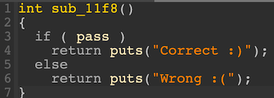
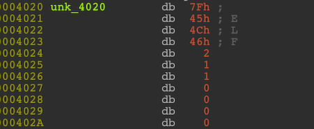

# 2022 交大程式安全 HW3 writeup

執行環境：2020 M1 macbook pro (arm晶片非x86)\
執行檔執行環境：docker ubuntu x86-64 container\
逆向工具： IDA 64 bits Freeware for Mac (Version 8.1.221006 macOS x86_64)

## [LAB] Sacred Arts

首先用 IDA 逆執行檔，從其組語中可觀察出程式會先對 /tmp/flag 這個檔案進行開檔的動作\
如果檔案不存在或是開檔失敗就會輸出 wrong，並正常終止程序\
如果成功開檔，將會跳到 40106F


而 40106F 會將剛才開檔的對象進行讀檔的動作，讀 0x32 個 bytes，接著跳到 4010C3


rcx 會設定成 7，而 40108B 這個地方有一些資料，rbx 會設定成這個位置\
接著是比較奇怪的指令，它會用 lea 去取這個位置
```python
lea rdx, ds:0FFFFFFFFFFFFFFF8h[rcx*8]
```
ds 在 64 bits 之下的值為 0，所以就是 0\
而 0FFFFFFFFFFFFFFF8h 是個二補數，代表 -8\
因此整個指令在做的事情其實就是
```python
rdx = rcx * 8 - 8
```
接下來對 rsp+rdx 這個位置取值，並乘上 -1\
然後將最後一個 byte 與倒數第二個 byte 交換\
把經過運算後的結果與 rbx+rdx 取出來的值做比較\
如果一樣，就跳到 401035，也就是輸出 wrong\
而 loop 這個指令是用來做迴圈運算\
當 rcx 不為 0 時，會將 rcx 減 1，並跳回 4010D1\
一直重複執行到 rcx 等於 0 時就終止迴圈，最後跳到 4010FD


它最後應該會印出 401066 裡的資料，但卻發現是很奇怪的組語


於是推論這裡應該是 IDA 的判斷有錯，所以按快捷鍵 u 將它 undefine 掉\
果然，這邊是要印出 correct 才對


因此這題的重點就是迴圈的部分了，從迴圈裡每次 rcx 都要乘以 8 來看\
推測每次從 40108B 裡讀的資料應該是 8 bytes，而不是 1 byte\
所以 40108B 的部分應該也是 IDA 判斷有誤，於是按 3 次 d 將它修正為 8 bytes 的 qword


後面仍接著一長串資料，也推測應該是資料長度為 8 bytes 的 array\
於是按右鍵選 Array，size 設成 7，Items on a line 設成 1\
而這些資料就是經過運算加密過後的 flag，把它改名為 enc_flag，這樣會清楚許多


嘗試將迴圈的運算寫成 pseudocode 就會是
```c
for(rcx = 7; rcx > 0 ; rcx--){
    rdx = rcx * 8 - 8;
    value1 = flag[rdx];
    value1 *= -1; // 實際上會是取 two's complement 然後 +1
    將 value1 的最後一個 byte 與倒數第二個 byte 交換;
    value2 = enc_flag[rdx];
    if(value1 != value2){
        puts("wrong");
        exit(0);
    }
}
puts("correct");
```
知道 enc_flag 如何算出來後，只要倒回去算就能回推原本的 flag\
因此解題程式碼為
```python
# ex: '8D909984B8BEBAB3' to b'\xb3\xba\xbe\xb8\x84\x99\x90\x8d'
def hexstr_to_little_endian(s):
    lst = bytearray.fromhex(s)
    lst.reverse()
    return bytes(lst)

def twos_complement(n):
    return (n ^ ((1 << 64) - 1)) + 1

enc_flag = [
    '8D909984B8BEBAB3',
    '8D9A929E98D18B92',
    'D0888BD19290D29C',
    '8C9DC08F978FBDD1',
    'D9C7C7CCCDCB92C2',
    'C8CFC7CEC2BE8D91',
    'FFFFFFFFFFFFCF82'
]
enc_list = [hexstr_to_little_endian(s) for s in enc_flag]
flag = ''
for s in enc_list:
    AL_AH = s[0:2]
    s = AL_AH[::-1] + s[2:] # xchg al, ah
    s = twos_complement(int.from_bytes(s, 'little')) # nag rax
    flag += int.to_bytes(s, 8, 'little').decode()
print(flag)
```
成功得到 flag
```sh
FLAG{forum.gamer.com.tw/C.php?bsn=42388&snA=1807}
```
參考資料：交大網路安全策進會 Bamboofox 社課\
2022-10-12 上課錄影 https://youtu.be/htqMSWqi4Ps

## [LAB] Kekkou

首先用 IDA 逆執行檔，在 main 裡面反編譯它\
一開始程式會先讀 65 個字元進來，也就是 flag 字串，接著將 flag 字串傳進 11F1 function 裡


稍微標示一下讓它清楚些


flag 的第 i 個字元會傳進 1169 function 裡，這邊可看到它先要了 0x18 個 bytes 的記憶體\
並進行初始化的動作，由此可知 result 應該是個 struct


對 result 按右鍵選 Reset pointer type


然後對 result 按右鍵選 Create new struct type，並定義結構

```c
struct my_struct
{
  _QWORD var1;
  _QWORD var2;
  _BYTE var3;
};
```

於是就可得知此 function 是在初始化結構，並將 value 設定成傳入的 flag 第 i 個字元


所以 v2 是 my_struct * 才對


接著來看一下 11AC function


將 a2 的 type 修改為 my_struct *\
可以看到這裡有一堆指來指去的操作，於是可以推測這是 linked list 的操作


a1 極有可能也是 my_struct，於是也將 a1 的 type 改為 my_struct *


既然是 linked list 的操作，那麼可以設想 my_struct 其實就是 linked list 的 node\
而 var1 和 var2 其實就是 next node 或是 previous node\
但仔細想想，如果 var2 設成 next node 會不太合理\
因此 var2 是 previous node，而 var1 是 next node\
於是按 shift+F1 進到 Local types，將之前的 my_struct 修改為

```c
struct Node
{
  struct Node *next;
  struct Node *previous;
  _BYTE value;
};
```
重新反編譯 11AC function，就會知道它會將新的 node a2 插入到 node a1 的 previous


重新反編譯 11F1 function，並做一些改名


而 a1 是 i = 0 時的 node，也就是最一開始的 node，在 linked list 裡就是 head\
最後可以得知此 function 會把一堆 Node 串成一個 linked list


重新反編譯 main function 並做一些改名


接著來看 125F function


對傳入參數的名字和 type 進行修改


從中可看出有好幾個地方都是以 3 的倍數來取值，因此推斷這邊是 3 個 bytes 的結構\
而我們也看看 4040 和 4041 存資料的地方，會覺得有點奇怪


於是也合理懷疑這邊是 IDA 的判斷錯誤，3 個 bytes 的結構應該要從 4040 開始，而不是 4041\
因此先進到 Local types 新增一個新的 3 bytes 結構

```c
struct my_array_struct
{
  _BYTE var1;
  _BYTE var2;
  _BYTE var3;
};
```
並將 byte_4041 給 undefine 掉


在 unk_4040 上面按 y，重新命名為 my_array_struct


在 stru_4040 上面按右鍵選 Array，按 OK，並在 stru_4040 上面按 y 將 type 修改為

```c
my_array_struct stru_4040[];
```

成功修回來


重新反編譯


從中可得知當結構中的第二個值為 0 的時候，將會跳出迴圈 (11-13行)


而 15 行是取出結構中第一個值，而我們可以把 v4 的 type 改為 my_array_struct\
雖然會跳出警告視窗，不過還是按 Set the type 也還是能改\
重新反編譯，確實會清楚許多


看到這邊就能知道這個 function 在做什麼了\
由前面的 my_array_struct 存的資料個數可以知道迴圈會跑 65 次，接著在第 66 次 break 掉\
每一層迴圈中，會先取出結構中的第一個值，並與 1 做 and\
而一個數字和 1 做 and 完的結果，相當於去判斷它是奇數還是偶數\
如果值為 1，代表是奇數；如果值為 0，代表是偶數\
如果結構中的第一個值是奇數，head 將會往 next 的方向移動指定的次數\
移動的次數即為結構中的第二個值\
如果第一個值是偶數的話，head 會往 previous 的方向移動指定的次數\
迴圈每一層的最後，會將 head 落腳的位置裡面存的資料去 xor 結構中的第三個值\
這個動作就是將 flag 的每一個字元去做加密

接著來看 main 裡面的最後一個 function 131C 


將傳入的參數重新命名及更改 type，重新反編譯\
可看出它會將經過加密後的每一個 flag 值跟 4120 存的資料去做比對\
如果都一樣，會 return 1，然後 main function 印出 correct\
如果有不一樣，return 0，然後 main function 印出 wrong


因此我們的目標就是要回推出還沒經過加密的 flag\
最簡單的想法是倒過來做，但是我們並不知道 head 最後會落腳在哪裡\
用這方式可能會比較麻煩，於是換成另一種想法\
藉由之前的觀察可以知道每一次 xor 時，都是對一個 Node 裡存的值去做 xor\
運算沒什麼關聯性，而且也沒有順序的問題，再加上 xor 的加密和解密是一樣的\
所以只要對加密完的 flag 再進行一次加密的流程就會是解密，於是開始撰寫解題腳本

不過要先將 4040 和 4120 的資料取出，分別在上面按\
Edit -> Export data -> 選 hex string (spaced)，成功取出資料


最後的解題程式碼為

```python
struct_data = '75 1C D7 87 83 40 87 98 8A 39 30 93 A6 E6 21 68 44 6F 89 8D 3E B9\
 63 AF 1F 6B F6 86 31 37 3D 46 59 0C 13 23 DC 16 BD 38 C1 EE B1 FB DF 8D 2C 85 76\
 0A 0A 68 CB D9 A5 44 F5 6B 0E 82 F5 B8 B5 46 E3 69 30 8E 34 D0 83 2F D5 FD 66 CA\
 6B 45 41 70 FE A8 65 D7 4B 32 EA A7 BD D0 56 F0 94 4C DF EE 56 69 DE 61 3C 70 B9\
 D6 F3 D6 F7 B3 0F F0 99 6B 1B B7 B1 B5 15 1B 23 B0 62 59 E3 64 82 2F 29 20 01 F4\
 C7 28 29 4D DE AC 3A D8 30 29 04 23 8C D6 0C 1B 4A 5E 79 F4 E5 72 75 FC EF B1 9F\
 D5 5C B4 19 B4 E9 D4 51 51 C1 16 EF 47 78 FF 68 29 0D E7 27 FB 60 39 4E B4 9F F3\
 86 2E 71 75 C9 C6 27 2D 0B CB E9'
struct_list = struct_data.split(' ')
struct_list = [int(s, 16) for s in struct_list]

enc_flag = '41 92 41 47 EF BC 65 8B F2 6F 75 5F 6D 75 DF 9A 5F B3 8F 61 89 31 61\
 F5 3F 5D 61 69 8F 21 9D 96 A7 61 5C EC 03 5F 70 3C C0 DC 79 56 6E 25 6F 5F BD DD\
 72 FF 73 34 69 B5 6D 58 5F 0C 49 40 72 C8 5D'
flag_list = enc_flag.split(' ')
flag_list = [int(s, 16) for s in flag_list]

head_index = 0
for i in range(0, len(struct_list), 3):
    direction = struct_list[i]
    step = struct_list[i+1]
    value = struct_list[i+2]
    if (direction & 1):
        head_index += step # odd
    else:
        head_index -= step # even
    head_index %= len(flag_list)
    flag_list[head_index] ^= value
print(bytes(flag_list).decode())
```
成功得到 flag
```sh
FLAG{kekkou_muri_jya_nai?nai_ai_kazoe_te_cyotto_kurushi_ku_na_ru}
```

參考資料：交大網路安全策進會 Bamboofox 社課
2022-10-12 上課錄影 https://youtu.be/htqMSWqi4Ps\
2022-10-19 上課錄影 https://youtu.be/7qbKBOAAZT4

## [LAB] Why

首先用 IDA 逆執行檔，在 main 裡面反編譯它


它會先讀入字串，然後將字串中每一個 byte - 10 去跟 enc_flag 比對看看有沒有一樣


如果全都一樣的話，pass = 1，不過這邊會發現若只是把 enc_flag + 10 並不會是 flag\
在 pass 上面按 x 查看在哪裡被使用到



也在 sub_11f8 上面按 x 查看在哪裡被使用到


會發現有 .fini_array，這是 main 後面會做的事情\
而上面會發現有 .init_array，這是 main 前面會做的事情\
而這邊有三個 function，分別來看看


第一個 function，它會將某個記憶體位址的權限設定為可讀可寫可執行\
(read=1，write=2，execute=4，所以加起來為 7)


第二個 function，它會將某個記憶體位址存的值先 not 然後 +1\
也就是進行 two's complement 運算


第三個 function，它會將剛才的 main_page 記憶體位置的權限設定為可讀可執行不可寫\
(read=1，execute=4，所以加起來為 5)


但是接下來就卡關了，看了很久還是回推不出他實際是在做什麼\
我是有一次剛好想到 enc_flag 的第一個 byte 是 0x50 = 80\
如果把值 -10，剛好就會變成 F 的 ascii code 70 (A-Z=65-90, a-z=97-122)\
於是就想說把 enc_flag 每一個 byte 都 -10 看看會怎麼樣\
先用 Edit -> Export data -> 選 hex string (spaced)，取出 enc_flag 的資料

```python
enc_flag = '50 56 4B 51 85 73 78 73 7E 69 70 73 78 73 69 77 7A 7C 79 7E 6F 6D 7E 2B 87'

flag_list = enc_flag.split(' ')
flag_list = [int(s, 16) - 10 for s in flag_list]
print(bytes(flag_list).decode())
```
結果還真的得到 flag
```sh
FLAG{init_fini_mprotect!}
```
所以這題逆向的部分雖然我沒有完全逆出來\
不過卻透過凱薩移位密碼的概念成功解出 flag 了

參考資料：交大網路安全策進會 Bamboofox 社課\
2022-10-19 上課錄影 https://youtu.be/7qbKBOAAZT4

## [HW] trace

首先跑看看執行檔


用 IDA 去逆執行檔並反編譯它，3～9 行的確是程式所印出的字串


先看 function 1289，它會產生一個另外的檔案 /tmp/cs_2022_fall_ouo\
並將 4020 存的資料寫入此檔案中




接著看 1346 function


它會 fork 出一個 child process\
而 child process 會執行 12DC function，接著來看 12DC function


```c
ptrace(PTRACE_TRACEME, 0, 0, 0)
表示此 process 將會被自己的 parent process 追蹤
```
execl 相當於直接跑執行檔的指令\
也就是說第 5 行會直接執行產生出來的檔案 /tmp/cs_2022_fall_ouo\
回到 main 裡面，看 13C8 function


PTRACE_SINGLESTEP 會將 child process 設定為一步一步去執行指令\
每一次指令執行完畢會先暫停，並通知 parent process\
這個應該是可以像 gdb 那樣一步一步執行，不過就是加上被 parent process 追蹤而已

而 PTRACE_GETREGS 會去讀取 child process 中某些暫存器的值，並將讀到的值存到 7960 裡


接著回到 main 裡面去看 146E 這個 function


PTRACE_PEEKTEXT 這邊做的事情是從 79E0 這個位置去讀資料\
如果讀到的資料的值為 0xE8CBCCDEADBEEFE8，if 條件就會為 true\
而 PTRACE_POKETEXT 這裡會在 79E0 這個位置寫入資料 0x9090909090909090\
因此可以得知這邊會把值為 0xE8CBCCDEADBEEFE8 的地方用 0x9090909090909090 覆蓋掉

看到這邊大概可以知道程式的行為會是\
產生一個執行檔 /tmp/cs_2022_fall_ouo\
-> fork 一個 child process\
-> child process 被 parent process 追蹤 (又或者是控制)\
-> child process 執行 /tmp/cs_2022_fall_ouo\
-> 執行 /tmp/cs_2022_fall_ouo 的時候，會一步一步執行\
-> parent process 每次會去讀 child process 的資料\
如果讀到的值是 0xE8CBCCDEADBEEFE8 就用 0x9090909090909090 覆寫掉

至於如果試著直接執行它產生出來的 cs_2022_fall_ouo 檔案，它會出現 segmentation fault


綜合前面的觀察，可以猜測 cs_2022_fall_ouo 要先讓 parent process 修改完才能正常運行\
目前執行會出現 segmentation fault 應該是代表檔案尚未被 parent process 修復完畢

那要修改什麼以及要如何修改 cs_2022_fall_ouo 的內容？這邊是我卡關最久的部分\
我嘗試了將 79E0 存的資料改成 0xE8CBCCDEADBEEFE8\
然後把修改過後的組語重新輸出成新的執行檔去跑\
又或者是用 IDA 去逆 cs_2022_fall_ouo 檔案\
也試過上網仔細查詢並深入研究前面那些圖裡面每一行 code 詳細是在幹嘛\
然而卻發現這些招數都沒什麼用，還是看不出什麼所以然

後來是想說，既然 parent process 會把從 child process 裡讀到的\
0xE8CBCCDEADBEEFE8 值用 0x9090909090909090 覆寫掉\
而且 child process 執行的檔案剛好又是 cs_2022_fall_ouo\
於是就會萌生一個念頭，如果直接改 cs_2022_fall_ouo 的檔案內容會怎麼樣？\
因此先讀檔，看 cs_2022_fall_ouo 檔案內容中有沒有 0xE8CBCCDEADBEEFE8

```python
with open('cs_2022_fall_ouo', 'rb') as f:
    s = f.read()
print(s)
```

檔案內容裡果然有 0xE8CBCCDEADBEEFE8 (要注意它會是 little endian)


接著寫一個腳本，將檔案內容裡的 0xE8CBCCDEADBEEFE8 全部替換為 0x9090909090909090\
然後輸出成一個新的執行檔叫 cs_2022_fall_ouo_new

```python
with open('cs_2022_fall_ouo', 'rb') as f:
    s = f.read()
#print(s)
out = s.replace(b'\xe8\xef\xbe\xad\xde\xcc\xcb\xe8', b'\x90\x90\x90\x90\x90\x90\x90\x90')

with open('cs_2022_fall_ouo_new', 'wb') as f:
    f.write(out)
```
跑看看新的執行檔 cs_2022_fall_ouo_new，終於能夠成功執行了！


這次沒有出現 segmentation fault，代表我們成功修復了 cs_2022_fall_ouo\
既然已經修好了 cs_2022_fall_ouo，接下來用 IDA 去逆它看看


 

前兩個 function 跟預期的一樣


function 4011CA 會將 s2 裡的資料的每一個 byte 去 xor 0x71 (而 i 會從 0 到 0x15)


接著是最後一個 function，它會讓你輸入字串\
然後比較輸入的字串和 s2 是否一模一樣


因此只要將 s2 每一個 byte 去 xor 0x71 就會是 flag 了，於是可開始撰寫解題腳本\
不過要先將 s2 的資料取出，在 s2 上面按右鍵選 Array，將 Array size 設為 24


Edit -> Export data -> 選 hex string (spaced)，成功取出 s2 的資料


最後的解題程式碼為

```python
enc_flag = '37 3D 30 36 0A 25 03 30 12 42 2E 3C 42 2E 40 37 2E 24 2E 12 30 3F 0C'
enc_flag = enc_flag.split(' ')
enc_flag = [int(s, 16) for s in enc_flag]

flag = ''
for i in enc_flag:
    flag += chr(i ^ 0x71)
print(flag)
```
成功得到 flag
```sh
FLAG{TrAc3_M3_1F_U_cAN}
```

參考資料：
https://omasko.github.io/2018/04/19/ptrace%E5%AD%A6%E4%B9%A0%E7%AC%94%E8%AE%B0I/\
https://binhack.readthedocs.io/zh/latest/os/linux/syscall/ptrace.html\
https://www.twblogs.net/a/5ef785485ddd268f20a8902c

## [HW] pwn_myself

