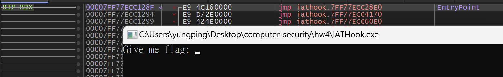
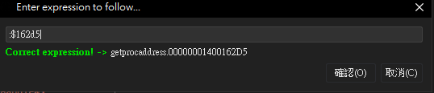
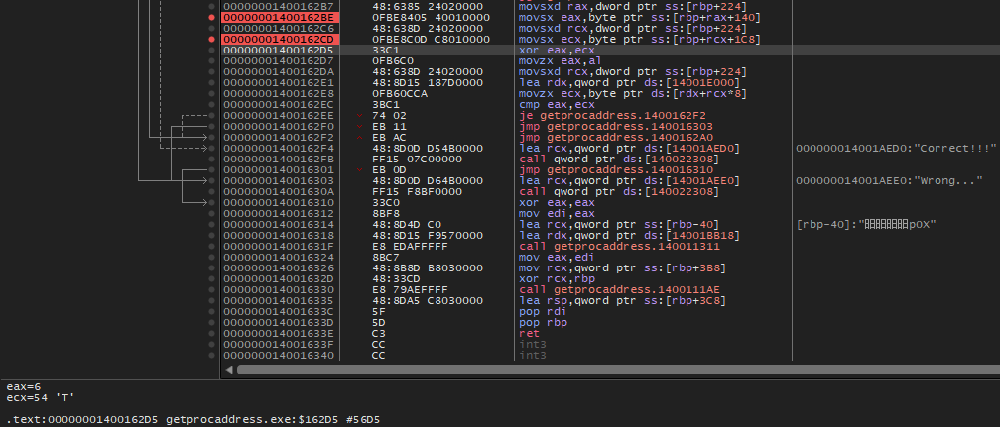
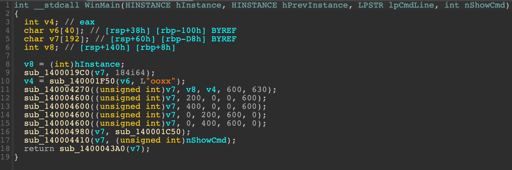
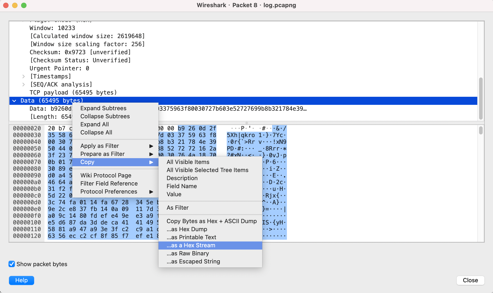
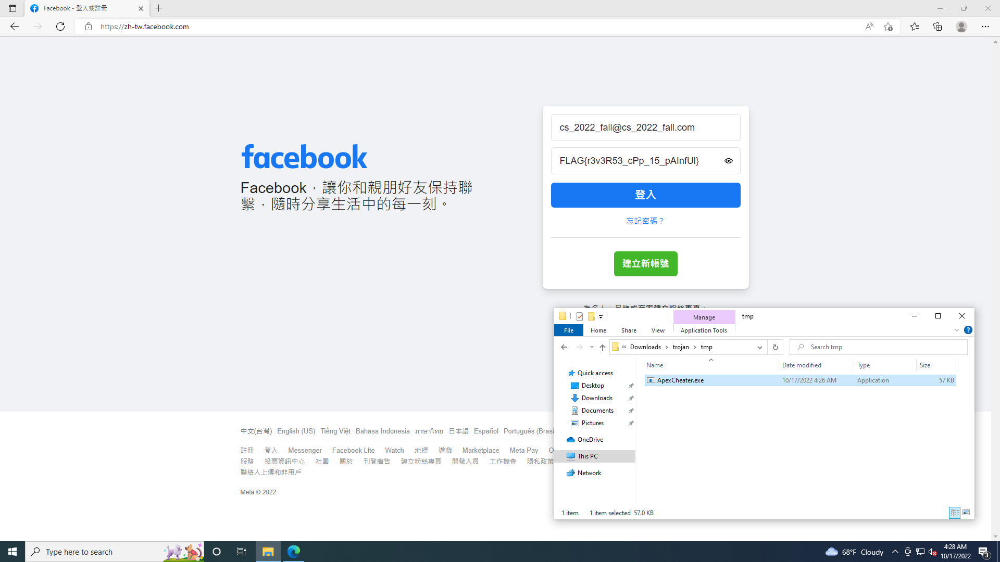

# 2022 交大程式安全 HW4 writeup

執行環境：2020 M1 macbook pro (arm晶片非x86)\
執行檔動態分析環境：Parallels Desktop 18 - win11 + x64dbg\
靜態分析工具： IDA 64 bits Freeware for Mac (Version 8.1.221006 macOS x86_64)

## [LAB] AMessageBox
題目給的是 windows 的 exe 執行檔\
跑起來會是要求輸入 flag 字串，然後會跳出 wrong 的小視窗\
首先照講師的方式用 x64dbg 開起來，按 F9 進到 EntryPoint，再按一次讓程式開始執行

接著輸入字串 (圖中輸入的長度為4)，然後按 enter，程式會執行到 1163 的位置

往上面找就會發現關鍵的程式邏輯，要想辦法讓程式跑進 correct 的分支而不是 wrong 的分支


在 10A9 設斷點，按 F9 繼續執行\
觀察 10A7 的暫存器 ecx 的值，得出 ecx = 0x4


在 10BB 設斷點，按 F9 繼續執行\
觀察 10B9 的暫存器 edx 的值，得出 edx = 0x26


在這些地方設斷點，按 F9，然後觀察 ecx 和 edx 的值\
因為 ecx 和 edx 值不同，所以會進到 wrong 的分支


反覆輸入不同的字串跑上述流程，會發現 edx 的值都固定是 26 不變\
只有 ecx 的值會變，而且 ecx 就是輸入字串的長度\
所以如果要讓程式進 correct 的分支的話，ecx 和 edx 的值必須要相同\
ecx 的值必須為 26，也就是說輸入字串的長度必須是 26 才行\
因此重新執行程式，輸入長度為 26 的字串


重新設斷點在這兩個位置去執行，這次確實沒有跳到 10F7 了


設斷點在 10C6 和 10E9，而程式沒有跳到 correct 分支


重新設定斷點，測試中間的運算在做什麼


cl = 0x61 (也就是 'a' 的 ascii code 97)


經過 ```rol cl,3``` 後，值變為 0xB


經過 ```xor cl,87``` 後，cl 值變為 0x8C


然後因為 cl 值不為 0xB5，因此跳到 wrong 分支


查了一下資料後可以知道 rol 是 rotate left 的指令
 ```rol a,n``` 會把 a 左移 n 個 bits
然後將低位的 n 個 bits 用原本的高位 n 個 bits 取代\
用這邊的例子來驗證\
0x61 轉成二進位 -> 01100001 -> 左移 3 bits -> 00001000\
將低位 3 bits 用原本的高位 3 bits 取代 -> 00001011 -> 1011 -> 0xB\
不過這邊比較需要注意的是，若未滿 8 個 bits 要記得補 0\
否則計算結果會是錯的，我當初耗很多時間在這\
而 0xB ^ 0x87 也確實等於 0x8C

到目前為止已知道它如何做加密\
接下來只要找出每一次加密完的值是多少，然後倒過來做就是解密了\
稍微觀察後可以發現，每一次加密完如果沒有跳到 wrong 分支的話\
它會把 eax + 1，然後下一次再跟新的值比對\
而比對的值似乎是放在 eax + 1003018 這個 address 裡\
因此點兩下這邊的 eax+1003018


下方就會跳出 eax+1003018 這個 address 裡存的內容


不出所料，果然是 0x26 個 bytes (38個)，因此這就是經過加密後的 flag\
接下來就可將資料複製下來，開始撰寫解題腳本

```python
# python3 AMessageBox/solve.py
def de_rol(num):
    s = bin(num)[2:]
    while len(s) < 8:
        s = '0' + s
    s = s[-2:] + s[:5]
    return int(s, 2)

enc_flag = 'B5 E5 8D BD 5C 46 36 4E 4E 1E 0E 26 A4 1E 0E 4E \
46 06 16 AC B4 3E 4E 16 94 3E 94 8C 94 8C 9C 4E \
A4 8C 2E 46 8C 6C'.split(' ')
flag = [chr(de_rol(int(s, 16) ^ 0x87)) for s in enc_flag]
print(''.join(flag))
```

成功找出 flag 為 ```FLAG{8699314d319802ef792b7babac9da58a}```

## [LAB] IAT Hook

題目給的是 windows 的 exe 執行檔\
正常跑起來會是程式要你輸入 flag 字串，然後跳出 wrong 的小視窗\
用 IDA 進到 main function 裡反編譯它


這題我用 IDA 看了很久，最後看出對解題有幫助的地方只有這邊\
main -> 11EA -> 1BE0 -> 13A2 -> 17F0


而其中的 1CE0 function 是講師上課時講過的 xor function，會將 v9 xor a2


20～23 行有個長度為 26 的迴圈會做 v9 和 byte_14001E070 的比對


因此猜測這邊是解出 flag 的關鍵，不過還不知道到這邊 v9 的值會變為什麽\
可先用 x64dbg 設斷點逐步執行來觀察出 v9 的值\
所以要先知道第 19 行呼叫 xor function 時，傳入的參數是什麼\
才能預測 v9 的值到第 22 行時會變為多少

用 x64dbg 進到 EntryPoint 後再按一次 F9 讓程式開始執行



接著要找 xor function 呼叫時對應在 x64dbg 的位置\
可透過 RVA 在 x64dbg 裡找出程式在執行時會對應到的 address\
而這邊 IDA 顯示的 address 11863 就是 RVA，因此就可用 11863 來查詢


按 ctrl+G


把數值刪掉，並點選下方的 $RVA，接著輸入 11863


就可找出程式執行時對應的位置


在 address 1877 設斷點，然後回到程式畫面輸入長度為 26 的任意字串，按 enter\
(因為前面有看到它會在長度 26 的 for 迴圈裡做比對)


而這邊的 r9d、r8d、rdx、rcx 就是之前第 19 行呼叫 xor function 時傳入的四個參數\
點選暫存器便可在下方看到它們的值分別是多少


因此可得知第 19 行 xor function 呼叫時傳的參數會是
```j_xor_140011CE0(輸入的字串, "Wrong", 26, 5);```

接下來只要讓 v9 經過 xor 後的數值等於 byte_14001E070 就行了\
我們只需要將 byte_14001E070 (加密過後的 flag)\
再去做一次 xor function 裡的操作就能解出原本的 flag 了\
把 byte_14001E070 的值存下來


Edit -> Export data -> 選 hex string (unspaced)\
接著開始撰寫解題腳本

 ```python
# python3 IAT Hook/solve.py
enc_flag = '113E2E291C1E333B312F383D04422A32011C0F0032300016262A'
Wrong = 'Wrong'
flag = [int(enc_flag[i:i+2], 16) ^ ord(Wrong[i//2 % 5]) for i in range(0, len(enc_flag), 2)]
print(bytes(flag).decode())
 ```

成功找出 flag 為 ```FLAG{IAT_HoOk,MessageBoxA}```

## [LAB] GetProcAddress

[由於此題的執行檔在 M1 mac 的 Parallel Desktop - win11 環境下\
使用 x64dbg 執行時，程式運行會不正常，無法進到正確的地方\
估計是 M1 晶片的問題，因此這邊 x64dbg 的部分暫時先用 win10 電腦跑]\

題目給的是 windows 的 exe 執行檔\
正常跑起來會是程式要你輸入長度為 39 的 flag 字串\
然後什麼都沒出現，程式就執行完畢了，連 wrong 也沒出現\
用 IDA 進到 main function 裡反編譯它


講師上課時有提到 13AC -> 18A0 這個 function


不過講師說只是要解題的話不看這編也沒差，所以先跳過不看\
18、22、23 行乍看之下也不太知道在幹嘛，先看下面的部分\
剛才有提到不管輸入什麼，程式連 wrong 都不會出現\
代表一般情況下應該不會進 if 的第一個區塊 (wrong 的部份)\
所以是進了 if 的第二個區塊 (correct 的部份)\
而從第 33 行的 if 判斷式，可以知道當 ```flag[j] xor v8[j] == byte_14001E000[8 * j]```

的時候，才會通過 correct 的判斷，這邊大概可看出只要將 byte_14001E000 xor v8 就能得出 flag\
因此來看一下 byte_14001E000，值已經初始化了


接著來看 v8，值還沒有初始化，所以現在目標是要拿到 v8 的值


由於剛才猜測程式應該會進 if 的第二個區塊，如果要找 v8 值的話\
可以先看看 xor 的那行組語，也就是 address 162D5 的地方\
透過 RVA 在 x64dbg 裡找出程式在執行時，會對應到哪裡，然後觀察暫存器的值


因此用 x64dbg 開起來跑看看，進到 EntryPoint 後再按一次 F9 讓程式開始執行


回到畫面中按 ctrl+G


刪掉數值後按 $RVA


接著輸入剛才的 162D5 (IDA 裡面的 address 即為程式執行時的 RVA)



便可搜尋到對應的位置 (下圖中灰色選取起來的部分)\
由於想找的是 v8 值，而 v8 有進行 xor，因此推測 eax 或 ecx 其中一個暫存器會存 v8 的值\
接著來觀察看看 eax 和 ecx 的值，在以下兩個地方設斷點



回到程式畫面，輸入隨意的字串，按 enter


成功跳到指定的位置了，代表進到第二個 if 區塊的猜測是對的\
由於想獲取 eax 的值，再加上 address 162BE 會將後面那串東西 assign 給 eax\
因此來看看後面那串東西的值是什麼，在紅框處點兩下


下方的內容就會變為 address rbp+rax*1+140 裡面存的值了


而這邊剛好又是 39 個 bytes，蠻有可能就是 v8 的值，先複製下來\
繼續往下看，按 F9，讓程式停在 address 162CD\
觀察 ecx 後面那一串東西存的值\
也是一樣在 rbp+rcx*1+1CB 上面點兩下，下方就會顯示出這個 address 裡存的值了\
可看出就是我們輸入的字串內容


看到這邊大致上可確定 eax 是 v8 的值，而 ecx 是輸入的字串\
因此可開始撰寫解題腳本，將 byte_14001E000，也就是加密過後的 flag 值從 IDA 中存下來\
Edit -> Export data -> 選 hex string (spaced)


解題腳本就會是

 ```python
# python3 GetProcAddress/solve.py
v8 = '54 68 69 73 20 70 72 6F 67 72 61 6D 20 63 61 6E \
6E 6F 74 20 62 65 20 72 75 6E 20 69 6E 20 44 4F \
53 20 6D 6F 64 65 2E'.split(' ')

enc_flag = '12 00 00 00 00 00 00 00 24 00 00 00 00 00 00 00 28 00 00 00 00 \
00 00 00 34 00 00 00 00 00 00 00 5B 00 00 00 00 00 00 00 3A 00 00 00 00 00 \
00 00 07 00 00 00 00 00 00 00 1C 00 00 00 00 00 00 00 13 00 00 00 00 00 00 \
00 2D 00 00 00 00 00 00 00 00 00 00 00 00 00 00 00 32 00 00 00 00 00 00 00 \
43 00 00 00 00 00 00 00 16 00 00 00 00 00 00 00 12 00 00 00 00 00 00 00 1A \
00 00 00 00 00 00 00 01 00 00 00 00 00 00 00 02 00 00 00 00 00 00 00 1D 00 \
00 00 00 00 00 00 5A 00 00 00 00 00 00 00 07 00 00 00 00 00 00 00 01 00 00 \
00 00 00 00 00 7F 00 00 00 00 00 00 00 35 00 00 00 00 00 00 00 10 00 00 00 \
00 00 00 00 1A 00 00 00 00 00 00 00 70 00 00 00 00 00 00 00 1B 00 00 00 00 \
00 00 00 01 00 00 00 00 00 00 00 43 00 00 00 00 00 00 00 05 00 00 00 00 00 \
00 00 2B 00 00 00 00 00 00 00 37 00 00 00 00 00 00 00 52 00 00 00 00 00 00 \
00 08 00 00 00 00 00 00 00 1C 00 00 00 00 00 00 00 17 00 00 00 00 00 00 00 \
44 00 00 00 00 00 00 00 53 00 00 00 00 00 00 00 00 00 00 00 00 00 00 00 00 \
00 00 00 00 00 00 00 00 00 00 00 00 00 00 00 00 00 00 00 00 00 00 00 00 00 \
00 00 00 00 00 00 00 00 00 00 00 00 00 00 00 00 00 00 00 00 00 00 00 00 00 \
00 00 00 00 00 00 00 00 00 00 00 00 00'.replace('00 00 00 00 00 00 00 ', '')
enc_flag = enc_flag.split(' ')

flag = [chr(int(enc_flag[i], 16) ^ int(v8[i], 16)) for i in range(len(v8))]
print(''.join(flag))
 ```
成功找出 flag 為 ```FLAG{Just_a_customized_GetProcAddress!}```

## [HW] ooxx

題目給的是 windows 的 exe 執行檔，是個圈圈叉叉的小遊戲\
我方是圈圈，敵方是叉叉，不過玩完後會發現，我方必不可能勝利\
遊戲結果只可能是敵方贏或平手，不會有我方勝利的情形

而題目有提示說 Win this game to get flag\
代表可能需要透過某些方式竄改程式邏輯或執行流程，讓遊戲結果變為我方勝利\
因此要先找出判斷輸贏的 function 在哪裡，於是先用 IDA 做靜態分析，反編譯它



一個一個找看看哪個最有可能是判斷輸贏的 function\
最後從 WinMain -> 1C50 function 找到 17F0 function 就是判斷輸贏的 function\
有三個 if 區塊，分別代表了三種情形：我方勝利、敵方勝利、平手\
而中間的 if 區塊，合理猜測是我方勝利的分支，因為裡面有呼叫兩個 messagebox\
第一個 messagebox 是顯示哪方勝利\
而第二個 messagebox 的話，根據題目的提示，大概能猜到它會用來秀出 flag 字串


因此目標是要竄改程式的執行流程，讓它執行到第二個 if 的分支\
而這個部份可透過 x64dbg 修改暫存器的值之類的方式來達成\
所以要先找出，用 x64dbg 設斷點逐步執行 ooxx 時，需要竄改的地方在哪裡\
這時直接找組語應該會比較快\
由於想進入第二個 if 的分支\
第 11 行 ```if ( (unsigned int)sub_1400014D0() )``` 必須要為 false\
所以要竄改的程式流程就是這邊，因此切回組語的畫面，然後 Search -> Text\
搜尋 sub_1400014D0，勾選 Find all occurrences -> OK


就能找出組語在哪邊有 call sub_1400014D0 (點兩下進到對應的組語畫面)


這裡就是對應三個 if 分支的組語，中間的分支有 call 兩個 messagebox\
也就是我們希望程式執行時進入的分支\
而從圖中的組語可以看出\
若想讓程式進入第二個分支並且執行完裡面的兩個 messagebox function 的話\
必須要符合兩個條件：

1. Address 180E：暫存器 eax 的值為 0


2. Address 186F：暫存器 eax 的值不為 0，否則會跳到第三個分支


而 Address 180E 和 186F 其實就是 RVA (相對位置)\
由於 IDA 畫面中的 address 和 x64dbg 開起來執行時的 address 會不同\
到時候要用這兩個 RVA 值才能在 x64dbg 裡找出對應的位置

接下來，開始用 x64dbg 進行動態分析\
按 F9 進到 EntryPoint，再按一次 F9，程式開始執行


接著隨便下兩個圈圈


回到 x64dbg，按 ctrl+G


刪掉搜尋欄裡的數值，然後按下方的 $RVA


接著輸入 180E，來搜尋 RVA 為 0x180E 的位置 (搜尋的時候可以不用打 0x)


在 180E 和 186F 下斷點


然後把圈圈下在不會擋到叉叉連成一條線的地方


這時 eax 的值為 0，符合前面剛才講的條件，所以不用動它
(eax 在 64 位元下就是 rax)


接著按 F9，讓程式執行到 186F
這時 eax 的值為 0，不符合前面的條件，所以要篡改它的值


在 RAX 的值上面點兩下，將值修改為不是 0 的數值，我這裡修改為 2


接著按 F9，成功讓程式進到分支二


按確定後


成功找出 flag 為 ```FLAG{Y0u_Won_A_gaM3_yoU_cOuldn0T_pO5s16ly_w1n}```

## [HW] trojan

首先題目給了兩個檔案，一個是 trojan.exe，另一個是 log.pcapng\
先執行看看 trojan.exe


會發現每次執行時，游標旁邊的圈圈總是出來一下子就消失\
於是會懷疑它是不是 segmentation fault，因此用 cmd 或 power shell 打指令跑看看


結果沒有出現 segmentation fault，也就是說程式是正常結束運行的\
接著用 IDA 來分析 trojan.exe，可看到是個 PE 64 位元的 windows exe 執行檔


進來 IDA 後馬上就是 WinMain 的組語畫面，直接反編譯它


馬上看到有一個 127.0.0.1 的字串，也就是 localhost\
而稍微觀察後也會發現 7E30 function 在處理跟 socket 有關的東西


因為以前上網路程式設計課的時候，有寫過 socket 網路程式的經驗\
再加上前面的 127.0.0.1 字串，所以推測程式會用 socket 去建立網路連線

接著問題就來了，為何它要大費周章建立 socket 和網路連線，難不成是要傳遞封包？\
這時想到題目有給了另外一個 log.pcapng 檔案，是個二進位檔\
於是上網查詢 pcapng 這個檔案類型是什麼


查完後可以得知，用 wireshark 可以將側錄到的封包存成 pcapng 檔記錄下來\
於是嘗試用 wireshark 開啟 log.pcapng 檔案看看


可看到有 SYN、ACK、PSH、FIN 這幾個關鍵字\
再加上這些剛好又是我這學期去修計算機網路上課教的內容\
所以馬上看出這些封包是在建立 TCP 連線\
而中間那三個長度比較大的封包就是這個 TCP 連線裡要傳遞的資料，也就是 payload\
因此推測 trojan.exe 程式建立 socket 的目的就是要建立 TCP 連線來傳這個 data

根據剛才查詢的資料，這個要傳的 data 極有可能是 png 圖片檔\
又或者是另一個需要去做逆向分析的執行檔\
於是想看看這個 data 到底是什麼檔案，首先打開第一個長度為 65539 的封包\
在 Data 的部份按右鍵將 byte data 存成十六進位 (hex) 的字串\
然後放到自己建立的 payload.txt 檔案裡



也對第二個長度為 65539 的封包和長度為 23038 的封包進行同樣的操作\
將 hex data 接在後面放進 payload.txt 裡，如下圖


接著要把這一大串的 hex data 以 byte 的形式寫到檔案裡，才會是真正的二進位檔案\
於是寫一個 python 腳本來做這件事，最後輸出成 out 檔案

 ```python
# python3 trojan/payload.py
with open('payload.txt', 'r') as f:
    s = f.read()

payload = b''
for i in range(0, len(s), 2):
    payload += bytes.fromhex(s[i:i+2])

with open('out', 'wb') as f:
    f.write(payload)
 ```
接著用 linux 的 file 指令來看看 out 的檔案類型

 ```sh
file ./out
 ```

但卻發現輸出結果不是 png 圖檔或任何形式的執行檔


而且也已經再三檢查過存 hex data 的過程和 python 程式碼都沒有寫錯\
這樣的話大概也只有一種可能了，就是檔案有被加密過\
使得就算擷取封包內容，也無法輕易獲取加密前的檔案原始內容\
因此現在的目標是要想辦法解密 out 檔案

到目前為止可得知大概是 trojan.exe 對要傳的檔案進行了加密的動作\
這部分試過用 x64dbg 設斷點逐步執行做動態分析，但也沒看出什麼所以然\
於是改用 IDA 對 trojan.exe 做靜態分析，仔細去看每個 function 在幹嘛\
希望藉此方式來找出進行加密的程式碼到底藏在哪個 function 裡

而這邊是我卡最久的部分，即便我找了好久\
卻還是一直找不到加密的 function 到底是哪一個\
原本以為加密的 function 會藏在 while 迴圈的 2FA0 function 裡面\
但仔細看完後，似乎不在這裡面的樣子


之後是重新來過，從 WinMain 裡一個一個 function 去找\
最後，終於找到了最有可能的加密 function 是在\
WinMain -> 1560 function 裡的 14B0 function


這邊大概可猜測 a1 就是被加密的原始檔案，而 a2 是原始檔案的大小，v4 則是圖裡的字串\
寫成高階的 C code 大概是長得像這樣

 ```c
char v4[24] = "0vCh8RrvqkrbxN9Q7Ydx";
for (int i = 0; i < len(a1); i++){
    a1[i] ^= v4[i % 0x15];
}
(0x15ui64 後面的 ui64 只是想表達 unsigned int 64 bits 而已，可直接看成是 0x15 就好)
 ```

由於 xor 的特性是加密和解密都一樣，因此只要對每一個 byte 再做一次 xor 就是解密了\
開始撰寫解題腳本

 ```python
# python3 trojan/solve.py
with open('payload.txt', 'r') as f:
    s = f.read()

payload = b''
for i in range(0, len(s), 2):
    payload += bytes.fromhex(s[i:i+2])

v4 = '0vCh8RrvqkrbxN9Q7Ydx\0'
out = b''
for i in range(len(payload)):
    j = payload[i] ^ ord(v4[i % 0x15])
    out += j.to_bytes(1, 'little')

with open('output', 'wb') as f:
    f.write(out)
 ```

再用一次 file 指令去看 output 的檔案類型


這次確實是 png 圖檔了，接著打開檔案



成功找出 flag 為 ```FLAG{r3v3R53_cPp_15_pAInfUl}```

參考資料：https://hackmd.io/@hclee/H1Ao3Y6sN?type=view