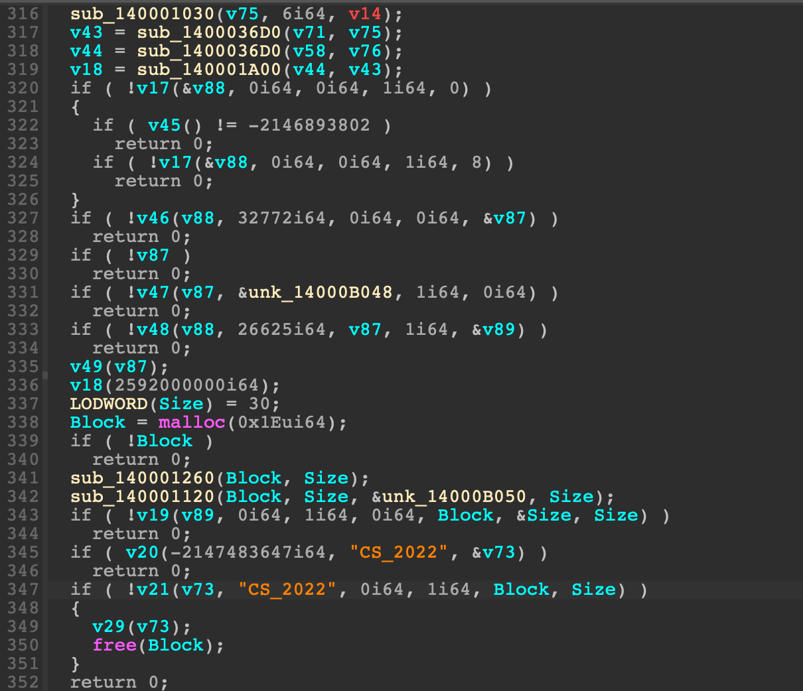
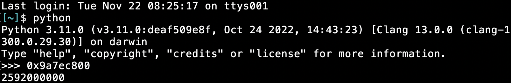
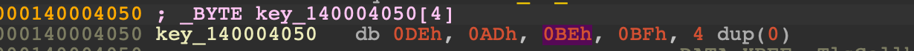

# 2022 交大程式安全 HW5 writeup
執行環境：2020 M1 macbook pro (arm晶片非x86)\
執行檔動態分析環境：Parallels Desktop 18 - win11 + x64dbg\
靜態分析工具： IDA 64 bits Freeware for Mac (Version 8.1.221006 macOS x86_64)

## [HW] dropper

把執行檔丟到 DIE 裡看，會發現有被加殼過\
它是被 UPX 加殼的，版本為 3.96


查詢 NRV 意思，得知它的加殼方式應該是壓縮殼\
也就是會將原執行檔做壓縮，加殼後檔案大小會變小


知道它有被加殼過後，接下來就是要想辦法拆殼\
這邊我找了蠻久的，原本都只有查到用 x64dbg 手動拆殼的方法

參考資料：
https://blog.30cm.tw/2015/02/upxiatdumpespoep.html
https://youtu.be/-MZxdGU9BS4

但試過這些後發現都行不通，完全找不到 pushad 和 popad 在哪裡\
以致於找不出 OEP (原始的entry point) 在哪邊\
因此暫時先放棄手動拆殼，去找了 UPX 工具看有沒有能拆殼的方法\
結果找到了原來 UPX 有拆殼的指令


透過以下指令來拆殼，拆殼完的檔案為 dropper_unpack.exe
```sh
upx -d dropper.exe -o dropper_unpack.exe
```
可以看到拆完殼的檔案大小比原始檔案大，更加確定是壓縮殼


而這邊我有遇過一個坑，upx 的版本必須要用最新的 4.0.1\
如果版本用 3.96 的話，雖然可以成功拆殼\
但是後續用 x64dbg 動態執行時，程式會卡在奇怪的地方，跑不進預期的位置

跑看看 dropper_unpack.exe，會發現不管按什麼鍵都沒反應\
程式卡在黑畫面不會結束執行，暫時沒有頭緒


用 IDA 反編譯，觀察 main function


接下來會看到一大串值跟 4 個 function，連續好幾段程式碼都是這樣


最後面則是長這樣



首先看 1030 function，它會把那一串值傳入並且做一些運算


```python
# dropper/script.py 
v62 = [0] * 13
v62[0] = -66
v62[1] = -102
v62[2] = -117
v62[3] = -99
v62[4] = -117
v62[5] = -109
v62[6] = -54
v62[7] = -54
v62[8] = -39
v62[9] = -110
v62[10] = -103
v62[11] = -104
v62[12] = -13
v62 =  [i ^ ~(v62[i]) for i in range(len(v62))]
print(bytes(v62).decode())

v64 = [0] * 13
v64[0] = -76
v64[1] = -101
v64[2] = -113
v64[3] = -110
v64[4] = -98
v64[5] = -106
v64[6] = -54
v64[7] = -54
v64[8] = -39
v64[9] = -110
v64[10] = -103
v64[11] = -104
v64[12] = -13
v64 = [i ^ ~(v64[i]) for i in range(len(v64))]
print(bytes(v64).decode())
```
輸出結果為


會發現這些值傳入 1030 function 後，會變成 dll 或 module 的字串，剩下的也一樣依此類推\
於是可以知道 1030 function 會把 dll 或 module 的名稱解密出來\
接下來會經過 1A00 function，會看到 InMemoryOrderModuleList 和 Flink 等關鍵字


這時突然想到 reverse 第二週的上課內容\
於是大概可以知道 1A00 function 會對傳入的 module 去做遍歷之類的動作\
而且透過 x64dbg 進行動態分析也能確認它會把 module 名稱轉為小寫 (圖中的 tolower function)


目前知道的大概只有這樣，剩下的部分就看不太懂在做什麼了\
這邊卡關了很久，不過後來突然有想到前面說的\
dropper_unpack.exe 執行時會卡在 cmd 視窗的黑畫面\
毫無反應，程式也不會結束執行，讓我想到說不定是 sleep function 的緣故\
程式裡面只要放一個 ```sleep(很大的數字)```，就能讓它卡在黑畫面很久了\
於是來找找看反編譯出來的程式碼裡頭有沒有疑似 sleep function 的地方\
有可能是 ```sleep(很大的數字)``` 的地方只有這兩個


接下來要使用 x64dbg 來測試看看這兩個 function 哪個是 sleep function\
先用 IDA 找出這兩個位置的 RVA 分別是 2CFB 和 2D07


用 x64dbg 開啟 dropper_unpack.exe 進入 entry point 後，按 ctrl+G\
刪除字串內容，然後按下方的 $RVA


輸入 2CFB，然後按確認


就能找到對應的位置，接著在這三個位置下斷點


按下一步(F9)，程式執行到第一個 function (尚未進入 call 裡面)


再按下一步(F9)，程式執行到第二個 function (尚未進入 call 裡面)


再按下一步(F9)，會發現這次 RIP 沒有移到第三個斷點 (2D0B)\
於是可以推論第二個 function 才是 sleep


知道哪個位置是 sleep function 後，由於它會 sleep 很久\
接下來要想辦法繞過它，也就是說希望把它改為 ```sleep(0)```
而 address 2D02 這行是傳入的參數值\
9A7EC800 的值確實和 IDA 裡反編譯出來的程式碼一樣 




重新執行程式，將傳入 sleep function 的值竄改為 0，讓它變為 ```sleep(0)```
要竄改的暫存器是 ecx，點兩下右邊紅框處的 rcx 值 (在 64 位元下 ecx 和 rcx 相同)


把值修改為 0


成功修改 ecx 的值


接著按下一步


由於成功改為 ```sleep(0)``` 的緣故，這次 RIP 終於跑到 2D0B 了\
接下來一直按單步步過 (F8) 觀察看看，結果發現 Flag 字串出現了！


在註解的地方點兩下，即可複製 flag 字串


將重複的雙引號刪除，成功找出 flag 為 ```FLAG{H3r3_U_G0_iT_Is_UR_flAg}```

## [LAB] TLS Callback

用 IDA 反編譯執行檔，首先會有一個 function list


分別會做 xor 0x87、not、xor 63 的運算


迴圈每次會從 function list 循環取出某個 function，對目前的 flag 字元進行對應的運算\
接著的 ```v7 = v5 & 3``` 相當於 ```v7 = v5 % 4```
因為 $3_{(10)}=11_{(2)}$，任意數和二進位的 11 做 and 後，高位的 bits 都會變為 0\
剩下的部分和 11 做 and 會保留原本的值\
v6 會指向 flag 的開頭，它每次會先 +1，然後再 -1 取值\
所以實際上也一樣是 flag 目前的字元 += 取出的 key 值



最後進行字串比對


根據講師的講解，在程式進入 main function 前，還會有兩個 TLS callback function


TLS callback 2 會將 function list 左移一個位置\
例如 [a, b, c] 會變為 [b, c, a]


而 TLS callback 1 會將 key 的每一個值按照目前的索引值從 function list 裡\
取出 function 進行對應的運算，也就是先把 key 加密\
不過講師有提到一個重點是，這題在進 main function 前\
不管先執行 TLS callback 1 還是 2，或是倒過來，答案都會是錯的\
用 PE bear 開啟執行檔，在 TLS 的地方可以看到共有三個 callback function


對應到的分別是 TLS callback 2 -> TLS callback 1 -> TLS callback 2


因此可以得知進 main function 前，會先執行 TLS callback 2\
然後執行 TLS callback 1，最後再執行一次 TLS callback 2\
了解整個程式在幹嘛後，開始撰寫解題腳本\
key 和 enc_flag 的部分按 Edit -> Export data -> 選 hex string (spaced) 就能把資料複製起來

不過這邊我有踩到一個坑，就是它的 key 和 enc_flag 疑似是用 ```unsigned char``` 而不是 ```char```
也就是說每個 byte 是用 ```0~255``` 而不是 ```-128~127```
導致運算後的 byte 數值大於 255 的情形，這時必須要 mod 256 才會是正常的\
因此若有運算後的數值超出 255 的部分，要先 mod 256
```python
# TLS Callback/solve.py
key = 'DE AD BE BF'
key = [i for i in bytearray.fromhex(key)]
# function list: xor 87, not, xor 63
# after TLS callback function 2, function list: not, xor 63, xor 87
# after TLS callback function 1
key[0] = ~key[0]
key[1] ^= 0x63
key[2] ^= 0x87
key[3] = ~key[3]
key = [i % 256 for i in key]
# after TLS callback function 2, function list: xor 63, xor 87, not
enc_flag = '46 99 F7 64 1D 79 44 22 C1 D3 27 CD 31 C1 D9 77 EC 7A 75 \
24 BF DD 24 DD 23 B2 CD 7C 02 58 46 24 AC D8 21 D1 5D BC C5 7C 05 6C \
48 2B BB D5 11 CB 35 B6 D9 57 0F 60 3F 34 FF EC'
flag = [i for i in bytearray.fromhex(enc_flag)]
for i in range(len(flag)):
    if i % 3 == 0:
        flag[i] = (flag[i] - key[i % 4]) ^ 0x63
    elif i % 3 == 1:
        flag[i] = (flag[i] - key[i % 4]) ^ 0x87
    elif i % 3 == 2:
        flag[i] = ~(flag[i] - key[i % 4])
flag = [i % 256 for i in flag]
print(bytes(flag).decode())
```
成功找出 flag 為 ```FLAG{The_first_TLS_callback_function_is_called_two_times!}```

## [LAB] Meow

用 IDA 反編譯執行檔


可以看到它會檢查輸入的字串長度是否為 39\
而最後面的 1C37 function 會進行字串比對\
所以 v2 應該是 enc_flag，a1 是 flag


根據講師的講解，1884 function 會進行 process hollowing\
會將執行檔內容注入到 process 裡並且執行起來


其中的 1550 function 會將 address 4040 存的內容進行解密\
也就是要注入的執行檔內容


接下來要想辦法把內容 dump 出來\
這邊透過講師教的方法，用 x64dbg 動態把記憶體內容 dump 出來


在 x64dbg 裡用 ctrl+G 來搜尋 15FE 這個 RVA 對應的位置，並設置斷點


輸入它長度 39 的字串然後按 enter，成功停在斷點


而 ds:[404040] 裡面存的就是要注入的執行檔內容\
在上面按右鍵->在資料視窗中跟隨->選常數


可以看到開頭是 MZ，於是能確定裡面的內容是 PE 執行檔\
接著按工具列的 Scylla，File->Dump Memory\
由於前面的 1550 function 裡是 i > 0x3FFF 會退出迴圈\
因此可以知道檔案大小是 0x4000，Size 輸入 4000，然後按 Dump


就會成功 dump 出 MEM_0000000000404040_00004000.mem\
而它也會是執行檔，用 IDA 反編譯它看看


裡頭的 1550 function 傳入的 lpBuffer 和 a1 就是 flag


flag 透過注入的執行檔加密完之後\
會用 pipe 來溝通，並將加密過後的 flag 寫回去給原本的程式讀\
也就是原本 main 裡面的第三個 function 1723


最後就是前面講的字串比對了，將加密後的 flag 和 enc_flag 比對是否相同\
了解整個程式在幹嘛後，開始撰寫解題腳本\
enc_flag 是 v2，直接複製反編譯出來的程式碼\
不過這裡要注意一下負值的部分倒回去算會是錯的，所以直接改成組語裡面的值就好\
而 key 的部分，在 byte_403010 上面按 Edit -> Export data -> 選 hex string (spaced)

```python
# Meow/solve.py
v2 = ['a'] * 39
v2[0] = 36
v2[1] = 29
v2[2] = 27
v2[3] = 49
v2[4] = 33
v2[5] = 11
v2[6] = 79
v2[7] = 15
v2[8] = 0xe8
v2[9] = 80
v2[10] = 55
v2[11] = 91
v2[12] = 8
v2[13] = 64
v2[14] = 74
v2[15] = 8
v2[16] = 29
v2[17] = 17
v2[18] = 74
v2[19] = 0xb8
v2[20] = 17
v2[21] = 103
v2[22] = 63
v2[23] = 103
v2[24] = 56
v2[25] = 20
v2[26] = 63
v2[27] = 25
v2[28] = 11
v2[29] = 84
v2[30] = 0xb4
v2[31] = 9
v2[32] = 99
v2[33] = 18
v2[34] = 104
v2[35] = 42
v2[36] = 69
v2[37] = 83
v2[38] = 14

key = '62 57 56 76 64 77 3D 3D 87 63 00 00 00 00 00 00'
key = bytes.fromhex(key)

for i in range(39):
    v2[i] -= 2 * (i % 3)
    v2[i] ^= key[i % 0xB]
print(bytes(v2).decode())
```
成功得出 flag 為 ```FLAG{pr0c355_h0ll0w1ng_4nd_n4m3d_p1p35}```

## [LAB] Exception

這題我是一聽完講師的講解後，就馬上寫解題腳本了


用自己的 IDA 把 enc_flag 的值 export 出來，Edit -> Export data -> 選 hex string (spaced)


而且講師也有說 key 是 0xbe 和 0xef 了，因此開始撰寫解題腳本\
不過這邊我也有遇到和 TLS 那題一樣的坑\
就是它的 key 和 enc_flag 疑似是用 ```unsigned char``` 而不是 ```char```
也就是說每個 byte 是用 ```0~255``` 而不是 ```-128~127```
導致運算後的 byte 數值大於 255 的情形，這時必須要 mod 256 才會是正確的\
因此若有運算後的數值超出 255 的部分，要先 mod 256
```python
# Exception/solve.py
enc_flag = 'E7 E3 72 78 AC 90 90 7C 90 AC B1 A6 A4 9E A7 A2 AC 90 \
B9 B2 BF BB BD B6 AB 90 BA B4 90 BF C0 C0 C4 CA 95 ED C0 B2 00'
flag = bytearray.fromhex(enc_flag)
for i in range(39):
    flag[i] = ((flag[i] - (i + 0xef)) % 256) ^ ((i + 0xbe) % 256)
print(bytes(flag).decode())
```
成功找出 flag 為 ```FLAG{__C_specific_handler_is_hooked:O}```
